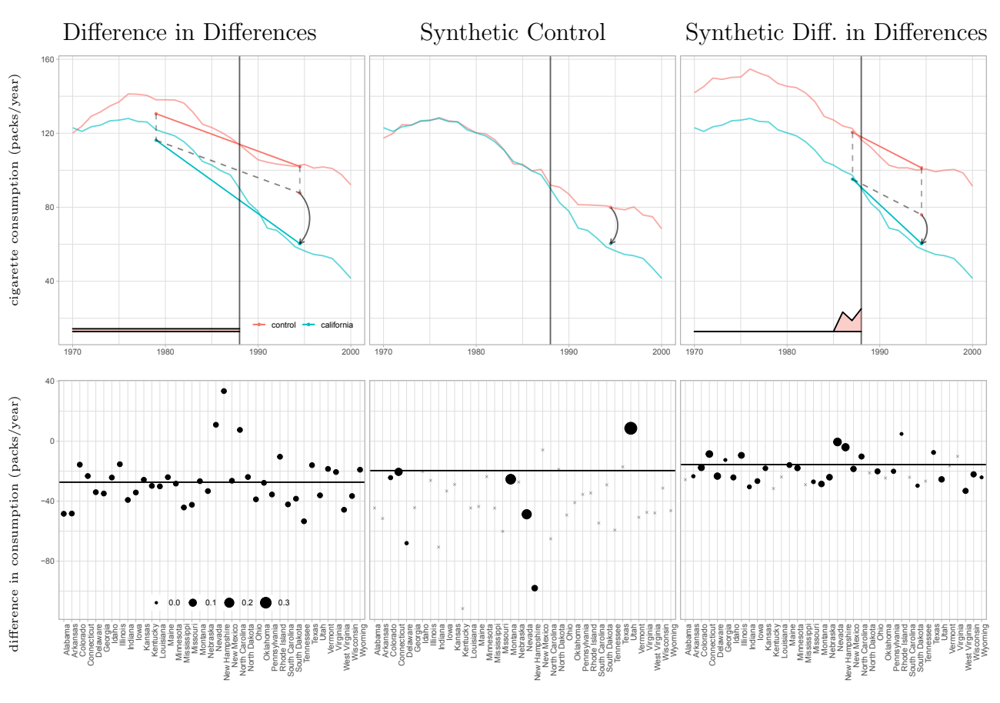
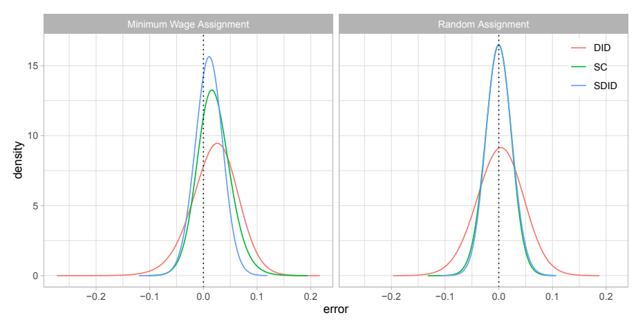
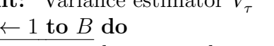
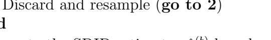
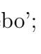

# SYNTHETIC DIFFERENCE IN DIFFERENCES

Dmitry Arkhangelsky 

Susan Athey 

David A. Hirshberg

Guido W. Imbens 

Stefan Wager 

Working Paper 25532 

http://www.nber.org/papers/w25532 

NATIONAL BUREAU OF ECONOMIC RESEARCH

1050 Massachusetts Avenue Cambridge, MA 02138 February 2019, 

Revised July 2021 

We are grateful for helpful comments and feedback from a co-editor and referees, as well as from Alberto Abadie, Avi Feller, Paul Goldsmith-Pinkham, Liyang Sun, Yiqing Xu, Yinchu Zhu, and seminar participants at several venues. This research was generously supported by ONR grant N00014-17-1-2131 and the Sloan Foundation. The R package for implementing the methods developed here is available at https://github.com/synth-inference/synthdid. The associated vignette is at https://synthinference. github.io/synthdid/. The views expressed herein are those of the authors and do not necessarily reflect the views of the National Bureau of Economic Research.

At least one co-author has disclosed additional relationships of potential relevance for this research. Further information is available online at http://www.nber.org/papers/w25532.ack NBER working papers are circulated for discussion and comment purposes. They have not been peer-reviewed or been subject to the review by the NBER Board of Directors that accompanies official NBER publications.

© 2019 by Dmitry Arkhangelsky, Susan Athey, David A. Hirshberg, Guido W. Imbens, and Stefan Wager. All rights reserved. Short sections of text, not to exceed two paragraphs, may be quoted without explicit permission provided that full credit, including © notice, is given to the source.

------------------------------------------------

Synthetic Difference In Differences Dmitry Arkhangelsky, Susan Athey, David A. Hirshberg, Guido W. Imbens, and Stefan Wager NBER Working Paper No. 25532 February 2019, Revised July 2021 JEL No. C01

#### Abstract

We present a new estimator for causal effects with panel data that builds on insights behind the widely used difference in differences and synthetic control methods. Relative to these methods we find, both theoretically and empirically, that this "synthetic difference in differences" estimator has desirable robustness properties, and that it performs well in settings where the conventional estimators are commonly used in practice. We study the asymptotic behavior of the estimator when the systematic part of the outcome model includes latent unit factors interacted with latent time factors, and we present conditions for consistency and asymptotic normality.

| Dmitry Arkhangelsky         | Guido W. Imbens             |
|-----------------------------|-----------------------------|
| CEMFI                       | Graduate School of Business |
| 5 Calle Casado del Alisal   | Stanford University         |
| Madrid 28014                | 655 Knight Way              |
| Spain                       | Stanford, CA 94305          |
| darkhangel@cemfi.es         | and NBER                    |
|                             | Imbens@stanford.edu         |
| Susan Athey                 |                             |
| Graduate School of Business | Stefan Wager                |
| Stanford University         | GSB                         |
| 655 Knight Way              | Stanford University         |
| Stanford, CA 94305          | Stanford, CA 94305          |
| and NBER                    | swager@stanford.edu         |
| athey@stanford.edu          |                             |

David A. Hirshberg Department of Statistics Stanford University Stanford, CA 94305 davidahirshberg@stanford.edu

------------------------------------------------

# 1 Introduction

Researchers are often interested in evaluating the effects of policy changes using panel data, i.e., using repeated observations of units across time, in a setting where some units are exposed to the policy in some time periods but not others. These policy changes are frequently not random—neither across units of analysis, nor across time periods—and even unconfoundedness given observed covariates may not be credible (*e.g.,* Imbens and Rubin [2015]). In the absence of exogenous variation researchers have focused on statistical models that connect observed data to unobserved counterfactuals. Many approaches have been developed for this setting but, in practice, a handful of methods are dominant in empirical work. As documented by Currie, Kleven, and Zwiers [2020], Difference in Differences (DID) methods have been widely used in applied economics over the last three decades; see also Ashenfelter and Card [1985], Bertrand, Duflo, and Mullainathan [2004], and Angrist and Pischke [2008]. More recently, Synthetic Control (SC) methods, introduced in a series of seminal papers by Abadie and coauthors [Abadie and Gardeazabal, 2003, Abadie, Diamond, and Hainmueller, 2010, 2015, Abadie and L'Hour, 2016], have emerged as an important alternative method for comparative case studies.

Currently these two strategies are often viewed as targeting different types of empirical applications. In general, DID methods are applied in cases where we have a substantial number of units that are exposed to the policy, and researchers are willing to make a "parallel trends" assumption which implies that we can adequately control for selection effects by accounting for additive unit-specific and time-specific fixed effects. In contrast, SC methods, introduced in a setting with only a single (or small number) of units exposed, seek to compensate for the lack of parallel trends by re-weighting units to match their pre-exposure trends.

In this paper, we argue that although the empirical settings where DID and SC methods are typically used differ, the fundamental assumptions that justify both methods are closely related. We then propose a new method, Synthetic Difference in Differences (SDID), that combines attractive features of both. Like SC, our method re-weights and matches pre-exposure trends to weaken the reliance on parallel trend type assumptions. Like DID, our method is invariant to additive unit-level shifts, and allows for valid large-panel inference. Theoretically, we establish consistency and asymptotic normality of our estimator. Empirically, we find that our method is competitive with (or dominates) DID in applications where DID methods have been used in the past, and likewise is competitive with (or dominates) SC in applications where

------------------------------------------------

SC methods have been used in the past.

To introduce the basic ideas, consider a balanced panel with N units and T time periods, where the outcome for unit i in period t is denoted by Yit, and exposure to the binary treatment is denoted by Wit ∈ {0, 1}. Suppose moreover that the first Nco (control) units are never exposed to the treatment, while the last Ntr = N −Nco (treated) units are exposed after time Tpre.

1 Like with SC methods, we start by finding weights ˆω sdid that align pre-exposure trends in the outcome of unexposed units with those for the exposed units, e.g., PNco i=1 ωˆ
sdid i Yit ≈ N
−1 tr PN
i=Nco+1 Yit for all t = 1*, . . . , T*pre. We also look for time weights λˆsdid tthat balance pre-exposure time periods with post-exposure ones (see Section 2 for details). Then we use these weights in a basic two-way fixed effects regression to estimate the average causal effect of exposure (denoted by τ ):2

$$
\left(\hat{\tau}^{\rm add},\,\hat{\mu},\,\hat{\alpha},\,\hat{\beta}\right)=\mathop{\rm arg\,min}_{\tau,\mu,\alpha,\beta}\,\left\{\sum_{i=1}^{N}\sum_{t=1}^{T}\Bigl{(}Y_{it}-\mu-\alpha_{i}-\beta_{t}-W_{it}\tau\Bigr{)}^{2}\hat{\omega}_{i}^{\rm add}\hat{\lambda}_{t}^{\rm add}\right\}.\tag{1.1}
$$

In comparison, DID estimates the effect of treatment exposure by solving the same two-way fixed effects regression problem without either time or unit weights:

$$
\left(\hat{\tau}^{\rm id},\,\hat{\mu},\,\hat{\alpha},\,\hat{\beta}\right)=\mathop{\rm arg\,min}_{\alpha,\beta,\mu,\tau}\,\left\{\sum_{i=1}^{N}\sum_{t=1}^{T}\Bigl{(}Y_{it}-\mu-\alpha_{i}-\beta_{t}-W_{it}\tau\Bigr{)}^{2}\right\}.\tag{1.2}
$$

The use of weights in the SDID estimator effectively makes the two-way fixed effect regression
"local," in that it emphasizes (puts more weight on) units that on average are similar in terms of their past to the target (treated) units, and it emphasizes periods that are on average similar to the target (treated) periods.

This localization can bring two benefits relative to the standard DID estimator. Intuitively, using only similar units and similar periods makes the estimator more robust. For example, if one is interested in estimating the effect of anti-smoking legislation on California (Abadie, Diamond, and Hainmueller [2010]), or the effect of German reunification on West Germany (Abadie, Diamond, and Hainmueller [2015]), or the effect of the Mariel boatlift on Miami (Card

1Throughout the main part of our analysis, we focus on the block treatment assignment case where Wit =
1 ({i > Nco*, t > T*pre}). In the closely related staggered adoption case (Athey and Imbens [2021]) where units adopt the treatment at different times, but remain exposed after they first adopt the treatment, one can modify the methods developed here. See Section 8 in the Appendix for details.

2This estimator also has an interpretation as a difference-in-differences of weighted averages of observations.

See Equations 2.4- 2.5 below.

------------------------------------------------

[1990], Peri and Yasenov [2019]), it is natural to emphasize states, countries or cities that are similar to California, West Germany, or Miami respectively relative to states, countries or cities that are not. Perhaps less intuitively, the use of the weights can also improve the estimator's precision by implicitly removing systematic (predictable) parts of the outcome. However, the latter is not guaranteed: If there is little systematic heterogeneity in outcomes by either units or time periods, the unequal weighting of units and time periods may worsen the precision of the estimators relative to the DID estimator.

Unit weights are designed so that the average outcome for the treated units is approximately parallel to the weighted average for control units. Time weights are designed so that the average post-treatment outcome for each of the control units differs by a constant from the weighted average of the pre-treatment outcomes for the same control units. Together, these weights make the DID strategy more plausible. This idea is not far from the current empirical practice. Raw data rarely exhibits parallel time trends for treated and control units, and researchers use different techniques, such as adjusting for covariates or selecting appropriate time periods to address this problem (e.g., Abadie [2005], Callaway and Sant'anna [2020]). Graphical evidence that is used to support the parallel trends assumption is then based on the adjusted data. SDID makes this process automatic and applies a similar logic to weighting both units and time periods, all while retaining statistical guarantees. From this point of view, SDID addresses pretesting concerns recently expressed in Roth [2018].

In comparison with the SDID estimator, the SC estimator omits the unit fixed effect and the time weights from the regression function:

$$\left(\hat{\tau}^{\rm sc},\,\hat{\mu},\,\hat{\beta}\right)=\arg\min_{\mu,\beta,\tau}\left\{\sum_{i=1}^{N}\sum_{t=1}^{T}\Bigl{(}Y_{it}-\mu-\beta_{t}-W_{it}\tau\Bigr{)}^{2}\hat{\omega}_{i}^{\rm sc}\right\}.\tag{1.3}$$

The argument for including time weights in the SDID estimator is the same as the argument for including the unit weights presented earlier: The time weight can both remove bias and improve precision by eliminating the role of time periods that are very different from the post-treatment periods. Similar to the argument for the use of weights, the argument for the inclusion of the unit fixed effects is twofold. First, by making the model more flexible, we strengthen its robustness properties. Second, as demonstrated in the application and simulations based on real data, these unit fixed effects often explain much of the variation in outcomes and can improve

------------------------------------------------

precision. Under some conditions, SC weighting can account for the unit fixed effects on its own. In particular, this happens when the weighted average of the outcomes for the control units in the pre-treatment periods is exactly equal to the average of outcomes for the treated units during those pre-treatment periods. In practice, this equality holds only approximately, in which case including the unit fixed effects in the weighted regression will remove some of the remaining bias. The benefits of including unit fixed effects in the SC regression (1.3) can also be obtained by applying the synthetic control method after centering the data by subtracting, from each unit's trajectory, its pre-treatment mean. This estimator was previously suggested in Doudchenko and Imbens [2016] and Ferman and Pinto [2019]. To separate out the benefits of allowing for fixed effects from those stemming from the use of time-weights, we include in our application and simulations this DIFP estimator.

# 2 An Application

To get a better understanding of how ˆτ did, ˆτ sc and ˆτ sdid compare to each other, we first revisit the California smoking cessation program example of Abadie, Diamond, and Hainmueller [2010]. The goal of their analysis was to estimate the effect of increased cigarette taxes on smoking in California. We consider observations for 39 states (including California) from 1970 through 2000. California passed Proposition 99 increasing cigarette taxes (i.e., is treated) from 1989 onwards. Thus, we have Tpre = 19 pre-treatment periods, Tpost = T − Tpre = 12 post-treatment periods, Nco = 38 unexposed states, and Ntr = 1 exposed state (California).

### 2.1 Implementing Sdid

Before presenting results on the California smoking case, we discuss in detail how we choose the synthetic control type weights ˆω sdid and λˆsdid used for our estimator as specified in (1.1).

Recall that, at a high level, we want to choose the unit weights to roughly match pre-treatment trends of unexposed units with those for the exposed ones, PNco i=1 ωˆ
sdid i Yit ≈ N
−1 tr PN
i=Nco+1 Yit for all t *= 1, . . . , T*pre, and similarly we want to choose the time weights to balance pre- and post-exposure periods for unexposed units.

In the case of the unit weights ˆω sdid, we implement this by solving the optimization problem

------------------------------------------------

ωˆ0, ωˆ sdid= arg min ω0∈R,ω∈Ω `unit(ω0, ω) where `unit(ω0, ω) = X Tpre t=1   ω0 +X Nco i=1 ωiYit − 1 Ntr X N i=Nco+1 Yit !2 + ζ 2Tpre kωk 2 2 , Ω =  ( ω ∈ R N + :X Nco i=1 ωi = 1, ωi = N −1 tr for all i = Nco + 1, . . . , N), (2.1)
where R+ denotes the positive real line. We set the regularization parameter ζ as

$$\zeta=(N_{\rm tr}T_{\rm post})^{1/4}\ \hat{\sigma}\ \ \ {\rm with}\ \ \hat{\sigma}^{2}=\frac{1}{N_{\rm co}(T_{\rm pre}-1)}\sum_{i=1}^{N_{\rm co}}\sum_{t=1}^{T_{\rm pre}-1}\left(\Delta_{it}-\overline{\Delta}\right)^{2},\tag{2.2}$$  where $\Delta_{it}=Y_{i(t+1)}-Y_{it}$, and $\overline{\Delta}=\frac{1}{N_{\rm co}(T_{\rm pre}-1)}\sum_{i=1}^{N_{\rm co}}\sum_{t=1}^{T_{\rm pre}-1}\Delta_{it}$.  
That is, we choose the regularization parameter ζ to match the size of a typical one-period outcome change ∆it for unexposed units in the pre-period, multiplied by a theoretically motivated scaling (NtrTpost)
1/4. The SDID weights ˆω sdid are closely related to the weights used in Abadie, Diamond, and Hainmueller [2010], with two minor differences. First, we allow for an intercept term ω0, meaning that the weights ˆω sdid no longer need to make the unexposed pre-trends perfectly match the exposed ones; rather, it is sufficient that the weights make the trends parallel. The reason we can allow for this extra flexibility in the choice of weights is that our use of fixed effects αi will absorb any constant differences between different units. Second, following Doudchenko and Imbens [2016], we add a regularization penalty to increase the dispersion, and ensure the uniqueness, of the weights. If we were to omit the intercept ω0 and set ζ = 0, then (2.1) would correspond exactly to a choice of weights discussed in Abadie et al. [2010] in the case where Ntr = 1.

------------------------------------------------

Algorithm 1: Synthetic Difference in Differences (SDID)
Data: Y ,W Result: Point estimate ˆτ sdid 1 Compute regularization parameter ζ using (2.2); 2 Compute unit weights ˆω sdid via (2.1);
3 Compute time weights λˆsdid via (2.3);
4 Compute the SDID estimator via the weighted DID regression

$$\left(\hat{\tau}^{\mathrm{sidd}},\,\hat{\mu},\,\hat{\alpha},\,\hat{\beta}\right)=\arg\operatorname*{min}_{\tau,\mu,\alpha,\beta}\left\{\sum_{i=1}^{N}\sum_{t=1}^{T}\Bigl(Y_{i t}-\mu-\alpha_{i}-\beta_{t}-W_{i t}\tau\Bigr)^{2}\hat{\omega}_{i}^{\mathrm{sidd}}\hat{\lambda}_{t}^{\mathrm{sidd}}\right\};$$

We implement this for the time weights λˆsdid by solving3

$$\left(\lambda_{0},\,\hat{\lambda}^{\text{solid}}\right)=\underset{\lambda_{0}\in\mathbb{R}_{n}\in\Lambda}{\arg\min}\,\ell_{time}(\lambda_{0},\lambda)\quad\text{where}$$ $$\ell_{time}(\lambda_{0},\lambda)=\sum_{t=1}^{N_{\text{res}}}\left(\lambda_{0}+\sum_{t=1}^{T_{\text{res}}}\lambda_{t}Y_{it}-\frac{1}{T_{\text{post}}}\sum_{t=T_{\text{res}}+1}^{T}Y_{it}\right)^{2},\tag{2.3}$$ $$\Lambda=\left\{\lambda\in\mathbb{R}_{+}^{T}:\sum_{t=1}^{T_{\text{res}}}\lambda_{t}=1,\,\lambda_{t}=T_{\text{post}}^{-1}\text{for all}t=T_{\text{pre}}+1,\,\ldots\,,T\right\}.$$

The main difference between (2.1) and (2.3) is that we use regularization for the former but not the latter. This choice is motivated by our formal results, and reflects the fact we allow for correlated observations within time periods for the same unit, but not across units within a time period, beyond what is captured by the systematic component of outcomes as represented by a latent factor model.

We summarize our procedure as Algorithm 1.4In our application and simulations we also report the SC and DIFP estimators. Both of these use weights solving (2.1) without regularization. The SC estimator also omits the intercept ω0.

5 Finally, we report results for the matrix

3The weights λˆsdid may not be uniquely defined, as `*time* can have multiple minima. In principle our results hold for any argmin of `*time*. These tend to be similar in the setting we consider, as they all converge to unique
'oracle weights' λ˜sdid that are discussed in Section 4.2. In practice, to make the minimum defining our time weights unique, we add a very small regularization term ζ 2Ncokλk 2to `*time*, taking ζ = 10−6 σˆ for ˆσ as in (2.2).

4Some applications feature time-varying exogenous covariates Xit ∈ R
p. We can incorporate adjustment for these covariates by applying SDID to the residuals Y
res it = Yit − Xitβˆ of the regression of Yit on Xit.

5Like the time weights λˆsdid, the unit weights for the SC and DIFP estimators may not be uniquely defined.

To ensure uniqueness in practice, we take ζ = 10−6 σˆ, not ζ = 0, in `*unit*. In our simulations, SC and DIFP with

------------------------------------------------

|                | SDID   | SC     | DID    | MC     | DIFP   |
|----------------|--------|--------|--------|--------|--------|
| Estimate       | \-15.6 | \-19.6 | \-27.3 | \-20.2 | \-11.1 |
| Standard error | (8.4)  | (9.9)  | (17.7) | (11.5) | (9.5)  |

Table 1: Estimates for average effect of increased cigarette taxes on California per capita cigarette sales over twelve post-treatment years, based on synthetic difference in differences (SDID), synthetic controls (SC), difference in differences (DID), matrix completion (MC), synthetic control with intercept (DIFP), along with estimated standard errors. We use the 'placebo method' standard error estimator discussed in Section 5.

completion (MC) estimator proposed by Athey et al. [2017], which is based on imputing the missing Yit(0) using a low rank factor model with nuclear norm regularization.

### 2.2 The California Smoking Cessation Program

The results from running this analysis are shown in Table 1. As argued in Abadie et al. [2010], the assumptions underlying the DID estimator are suspect here, and the -27.3 point estimate likely overstates the effect of the policy change on smoking. SC provides a reduced (and generally considered more credible) estimate of -19.6. The other methods, our proposed SDID, the DIFP and the MC estimator are all smaller than the DID estimator with the SDID and DIFP estimator substantially smaller than the SC estimator. At the very least, this difference in point estimates implies that the use of time weights and unit fixed effects in (1.1) materially affects conclusions; and, throughout this paper, we will argue that when ˆτ sc and ˆτ sdid differ, the latter is often more credible. Next, and perhaps surprisingly, we see that the standard errors obtained for SDID (and also for SCIFP, and MC) are smaller than those for DID, despite our method being more flexible. This is a result of the local fit of SDID (and SC) being improved by the weighting.

To facilitate direct comparisons, we observe that each of the three estimators can be rewritten as a weighted average difference in adjusted outcomes ˆδifor appropriate sample weights ˆωi:

$$\hat{\tau}=\hat{\delta}_{\rm tr}-\sum_{i=1}^{N_{\rm co}}\hat{\omega}_{i}\hat{\delta}_{i}\quad\mbox{where}\quad\hat{\delta}_{\rm tr}=\frac{1}{N_{\rm tr}}\sum_{i=N_{\rm co}+1}^{N}\hat{\delta}_{i}.\tag{1}$$

DID uses constant weights ˆω did i = N −1 co , while the construction of SDID and SC weights is

this minimal form of regularization outperform more strongly regularized variants with ζ as in (2.2). We show this comparison in Table 6.

$$\left(2.4\right)$$

------------------------------------------------

outlined in Section 2.1. For the adjusted outcomes ˆδi, SC uses unweighted treatment period averages, DID uses unweighted differences between average treatment period and pre-treatment outcomes, and SDID uses weighted differences of the same.

$$\hat{\partial}_{i}^{\mathrm{sc}}=\frac{1}{T_{\mathrm{post}}}\sum_{t=T_{\mathrm{pre}}+1}^{T}Y_{i t},$$ $$\hat{\partial}_{i}^{\mathrm{did}}=\frac{1}{T_{\mathrm{post}}}\sum_{t=T_{\mathrm{pre}}+1}^{T}Y_{i t}-\frac{1}{T_{\mathrm{pre}}}\sum_{t=1}^{T_{\mathrm{pre}}}Y_{i t},$$ $$\hat{\partial}_{i}^{\mathrm{sdid}}=\frac{1}{T_{\mathrm{post}}}\sum_{t=T_{\mathrm{pre}}+1}^{T}Y_{i t}-\sum_{t=1}^{T_{\mathrm{pre}}}\hat{\lambda}_{t}^{\mathrm{sdid}}Y_{i t}.$$

$$\left(2.5\right)$$

The top panel of Figure 1 illustrates how each method operates. As is well known [Ashenfelter and Card, 1985], DID relies on the assumption that cigarette sales in different states would have evolved in a parallel way absent the intervention. Here, pre-intervention trends are obviously not parallel, so the DID estimate should be considered suspect. In contrast, SC reweights the unexposed states so that the weighted of outcomes for these states match California pre-intervention as close as possible, and then attributes any post-intervention divergence of California from this weighted average to the intervention. What SDID does here is to re-weight the unexposed control units to make their time trend parallel (but not necessarily identical) to California pre-intervention, and then applies a DID analysis to this re-weighted panel. Moreover, because of the time weights, we only focus on a subset of the pre-intervention time periods when carrying out this last step. These time periods were selected so that the weighted average of historical outcomes predict average treatment period outcomes for control units, up to a constant. It is useful to contrast the data-driven SDID approach to selecting the time weights to both DID, where all pre-treatment periods are given equal weight, and to event studies where typically the last pre-treatment period is used as a comparison and so implicitly gets all the weight (*e.g.,* Borusyak and Jaravel [2016], Freyaldenhoven et al. [2019]).

The lower panel of Figure 1 plots ˆδtr−ˆδifor each method and for each unexposed state, where the size of each point corresponds to its weight ˆωi; observations with zero weight are denoted by an ×-symbol. As discussed in Abadie, Diamond, and Hainmueller [2010], the SC weights ˆω sc are sparse. The SDID weights ˆω sdid are also sparse—but less so. This is due to regularization and the use of the intercept ω0, which allows greater flexibility in solving (2.1), enabling more balanced

------------------------------------------------

Figure 1: A comparison between difference-in-differences, synthetic control, and synthetic differences-in-differences estimates for the effect of California Proposition 99 on per-capita annual cigarette consumption (in packs/year). In the first row, we show trends in consumption over time for California and the relevant weighted average of control states, with the weights used to average pre-treatment time periods at the bottom of the graphs. The estimated effect is indicated by an arrow. In the second row, we show the state-by-state adjusted outcome difference ˆδtr − ˆδi as specified in (2.4)-(2.5), with the weights ˆωiindicated by dot size and the weighted average of these differences - the estimated effect - indicated by a horizontal line. Observations with zero weight are denoted by an ×-symbol.

------------------------------------------------

weighting. Observe that both DID and SC have some very high influence states, that is, states with large absolute values of ˆωi( ˆδtr − ˆδi) (*e.g.*, in both cases, New Hampshire). In contrast, SDID does not give any state particularly high influence, suggesting that after weighting, we have achieved the desired "parallel trends" as illustrated in the top panel of Figure 1 without inducing excessive variance in the estimator by using concentrated weights.

# 3 Placebo Studies

So far, we have relied on conceptual arguments to make the claim that SDID inherits good robustness properties from both traditional DID and SC methods, and shows promise as a method that can be used is settings where either DID and SC would traditionally be used. The goal of this section is to see how these claims play out in realistic empirical settings. To this end, we consider two carefully crafted simulation studies, calibrated to datasets representative of those typically used for panel data studies. The first simulation study mimics settings where DID would be used in practice (Section 3.1), while the second mimics settings suited to SC (Section 3.2). Not only do we base the outcome model of our simulation study on real datasets, we further ensure that the treatment assignment process is realistic by seeking to emulate the distribution of real policy initiatives. To be specific, in Section 3.1, we consider a panel of US states. We estimate several alternative treatment assignment models to create the hypothetical treatments, where the models are based on the state laws related to minimum wages, abortion or gun rights.

In order to run such a simulation study, we first need to commit to an econometric specification that can be used to assess the accuracy of each method. Here, we work with the following latent factor model (also referred to as an "interactive fixed-effects model", Xu [2017], see also Athey et al. [2017]),

$$Y_{i t}=\gamma_{i}{\boldsymbol{v}}_{t}^{\top}+\tau W_{i t}+\varepsilon_{i t},$$
t + τWit + εit, (3.1)
where γiis a vector of latent unit factors of dimension R, and υtis a vector of latent time factors of dimension R. In matrix form, this can be written

$$\mathbf{Y}=\mathbf{L}+\tau\mathbf{W}+\mathbf{E}\quad{\mathrm{~where~}}\quad\mathbf{L}=\mathbf{\Gamma}\mathbf{\Upsilon}^{\mathsf{T}}.$$
Y = L + τW + E where L = ΓΥ>. (3.2)
$$\left(3.1\right)$$
$$\left(3.2\right)$$

------------------------------------------------

We refer to E as the idiosyncratic component or error matrix, and to L as the systematic component. We assume that the conditional expectation of the error matrix E given the assignment matrix W and the systematic component L is zero. That is, the treatment assignment cannot depend on E. However, the treatment assignment may in general depend on the systematic component L (i.e., we do not take W to be randomized). We assume that Eiis independent of Ei 0 for each pair of units *i, i*0, but we allow for correlation across time periods within a unit.

Our goal is to estimate the treatment effect τ .

The model (3.2) captures several qualitative challenges that have received considerable attention in the recent panel data literature. When the matrix L takes on an additive form, i.e.,
Lit = αi + βt, then the DID regression will consistently recover τ . Allowing for interactions in L is a natural way to generalize the fixed-effects specification and discuss inference in settings where DID is misspecified [Bai, 2009, Moon and Weidner, 2015, 2017]. In our formal results given in Section 4, we show how, despite not explicitly fitting the model (3.2), SDID can consistently estimate τ in this design under reasonable conditions. Finally, accounting for correlation over time within observations of the same unit is widely considered to be an important ingredient to credible inference using panel data [Angrist and Pischke, 2008, Bertrand, Duflo, and Mullainathan, 2004].

In our experiments, we compare DID, SC, SDID, and DIFP, all implemented exactly as in Section 2. We also compare these four estimators to an alternative that estimates τ by directly fitting both L and τ in (3.2); specifically, we consider the matrix completion (MC) estimator recommended in Athey, Bayati, Doudchenko, Imbens, and Khosravi [2017] which uses nuclear norm penalization to regularize its estimate of L. In the remainder of this section, we focus on comparing the bias and root-mean-squared error of the estimator. We discuss questions around inference and coverage in Section 5.

### 3.1 Current Population Survey Placebo Study

Our first set of simulation experiments revisits the landmark placebo study of Bertrand, Duflo, and Mullainathan [2004] using the Current Population Survey (CPS). The main goal of Bertrand et al. [2004] was to study the behavior of different standard error estimators for DID. To do so, they randomly assigned a subset of states in the CPS dataset to a placebo treatment and the rest to the control group, and examined how well different approaches to inference for DID

------------------------------------------------

estimators covered the true treatment effect of zero. Their main finding was that only methods that were robust to serial correlation of repeated observations for a given unit (*e.g.,* methods that clustered observations by unit) attained valid coverage.

We modify the placebo analyses in Bertrand et al. [2004] in two ways. First, we no longer assigned exposed states completely at random, and instead use a non-uniform assignment mechanism that is inspired by different policy choices actually made by different states. Using a non-uniformly random assignment is important because it allows us to differentiate between various estimators in ways that completely random assignment would not. Under completely random assignment, a number of methods, including DID, perform well because the presence of L in (3.2) introduces zero bias. In contrast, with a non-uniform random assignment (*i.e.*, treatment assignment is correlated with systematic effects), methods that do not account for the presence of L will be biased. Second, we simulate values for the outcomes based on a model estimated on the CPS data, in order to have more control over the data generating process.

#### 3.1.1 The Data Generating Process

For the first set of simulations we use as the starting point data on wages for women with positive wages in the March outgoing rotation groups in the Current Population Survey (CPS) for the years 1979 to 2019. We first transform these by taking logarithms and then average them by state/year cells. Our simulation design has two components, an outcome model and an assignment model. We generate outcomes via a simulation that seeks to capture the behavior of the average by state/year of the logarithm of wages for those with positive hours worked in the CPS data as in Bertrand et al. [2004]. Specifically, we simulate data using the model (3.2),
where the rows Ei of E have a multivariate Gaussian distribution Ei ∼ N (0, Σ), and we choose both L and Σ to fit the CPS data as follows. First, we fit a rank four factor model for L:

$$L:=\operatorname*{arg\,min}_{L:\mathrm{rank}(L)=4}\sum_{i t}(Y_{i t}^{*}-L_{i t})^{2},$$

2, (3.3)
where Y
∗
it denotes the true state/year average of log-wage in the CPS data. We then estimate Σ by fitting an AR(2) model to the residuals of Y
∗
it − Lit. For purpose of interpretation, we further decompose the systematic component L into an additive (fixed effects) term F and an

$$\left({\mathfrak{3}}.{\mathfrak{3}}\right)$$

------------------------------------------------

interactive term M, with

$$F_{i t}=\alpha_{i}+\beta_{t}=\frac{1}{T}\sum_{l=1}^{T}L_{i l}+\frac{1}{N}\sum_{j=1}^{N}L_{j t}-\frac{1}{N T}\sum_{i t}L_{i t},$$ $$M_{i t}=L_{i t}-F_{i t}.$$

$$\left({\boldsymbol{3.4}}\right)$$

This decomposition of L into an additive two-way fixed effect component F and an interactive component M enables us to study the sensitivity of different estimators to the presence of different types of systematic effects.

Next we discuss generation of the treatment assignment. Here, we are designing a "null effect" study, meaning that treatment has no effect on the outcomes and all methods should estimate zero. However, to make this more challenging, we choose the treated units so that the assignment mechanism is correlated with the systematic component L. We set Wit = Di1t>T0, where Diis a binary exposure indicator generated as

$$D_{i}\left|\right.\mathbf{E}_{i},\alpha_{i},\mathbf{M}_{i}\sim\text{Bernoulli}\left(\pi_{i}\right),\ \ \ \ \pi_{i}=\pi(\alpha_{i},\mathbf{M}_{i};\phi)=\frac{\exp(\phi_{\alpha}\alpha_{i}+\phi_{M}\mathbf{M}_{i})}{1+\exp(\phi_{\alpha}\alpha_{i}+\phi_{M}\mathbf{M}_{i})}.\tag{3.5}$$

In particular, the distribution of Di may depend on αi and Mi; however, Diis independent of Ei, i.e., the assignment is strictly exogenous.6 To construct probabilities {πi} for this assignment model, we choose φ as the coefficient estimates from a logistic regression of an observed binary characteristic of the state Di on Mi and αi. We consider three different choices for Di, relating to minimum wage laws, abortion rights, and gun control laws.7 As a result, we get assignment probability models that reflect actual differences across states with respect to important economic variables. In practice the αi and Mi that we construct predict a sizable part of variation in Di, with R2 varying from 15% to 30%.

#### 3.1.2 Simulation Results

Table 2 compares the performance of the four aforementioned estimators in the simulation design described above. We consider various choices for the number of treated units and the

6In the simulations below, we restrict the maximal number of treated units (either to 10 or 1). To achieve this, we first sample Diindependently and accept the results if the number of treated units satisfies the constraint.

If it does not, then we choose the maximal allowed number of treated units from those selected in the first step uniformly at random.

7See Section 7.1 in the appendix for details.

------------------------------------------------

|                       |     | F kF  k √   | k √MkF   | qtr(Σ)   | AR(2)          |       |             | RMSE   |       |       |               |       | Bias   |       |         |
|-----------------------|-----|-------------|----------|----------|----------------|-------|-------------|--------|-------|-------|---------------|-------|--------|-------|---------|
|                       |     | NT          | NT       | T        |                | SDID  | SC          | DID    | MC    | DIFP  | SDID          | SC    | DID    | MC    | DIFP    |
| Baseline              |     | 0.992       | 0.100    | 0.098    | (.01,\-.06)    | 0.028 | 0.037       | 0.049  | 0.035 | 0.032 | 0.010         | 0.020 | 0.021  | 0.015 | 0.007   |
| Outcome Model         |     |             |          |          |                |       |             |        |       |       |               |       |        |       |         |
| No Corr               |     | 0.992       | 0.100    | 0.098    | (.00, .00)     | 0.028 | 0.038       | 0.049  | 0.035 | 0.032 | 0.010         | 0.020 | 0.021  | 0.015 | 0.007   |
| No M                  |     | 0.992       | 0.000    | 0.098    | (.01, \-.06)   | 0.016 | 0.018 0.014 |        | 0.014 | 0.016 | 0.001         | 0.004 | 0.001  | 0.001 | 0.001   |
| No F                  |     | 0.000       | 0.100    | 0.098    | (.01, \-.06)   | 0.028 | 0.023       | 0.049  | 0.035 | 0.032 | 0.010         | 0.004 | 0.021  | 0.015 | 0.007   |
| Only Noise            |     | 0.000       | 0.000    | 0.098    | (.01, \-.06)   | 0.016 | 0.014 0.014 |        | 0.014 | 0.016 | 0.001         | 0.001 | 0.001  | 0.001 | 0.001   |
| No Noise              |     | 0.992       | 0.100    | 0.000    | (.00, .00)     | 0.006 | 0.017       | 0.047  | 0.004 | 0.011 | 0.004         | 0.004 | 0.020  | 0.000 | 0.001   |
| Assignment Process    |     |             |          |          |                |       |             |        |       |       |               |       |        |       |         |
| Gun Law               |     | 0.992       | 0.100    | 0.098    | (.01, \-.06)   | 0.026 | 0.027       | 0.047  | 0.035 | 0.030 | 0.008 \-0.003 |       | 0.015  | 0.015 | 0.009   |
| Abortion              |     | 0.992       | 0.100    | 0.098    | (.01, \-.06)   | 0.023 | 0.031       | 0.045  | 0.031 | 0.027 | 0.004         | 0.016 | 0.003  | 0.003 | 0.001   |
| Random                |     | 0.992       | 0.100    | 0.098    | (.01, \-.06)   | 0.024 | 0.025       | 0.044  | 0.031 | 0.027 | 0.001 \-0.001 |       | 0.002  | 0.001 | \-0.000 |
| Outcome Variable      |     |             |          |          |                |       |             |        |       |       |               |       |        |       |         |
| Hours                 |     | 0.789       | 0.402    | 0.575    | (.06, .00)     | 0.190 | 0.203       | 0.206  | 0.185 | 0.197 | 0.111 \-0.049 |       | 0.085  | 0.100 | 0.099   |
| U\-rate               |     | 0.752       | 0.441    | 0.593    | (\-.02, \-.01) | 0.191 | 0.184       | 0.353  | 0.247 | 0.187 | 0.100         | 0.080 | 0.304  | 0.187 | 0.078   |
| Assignment Block Size |     |             |          |          |                |       |             |        |       |       |               |       |        |       |         |
| Tpost = 1             |     | 0.992       | 0.100    | 0.098    | (.01, \-.06)   | 0.050 | 0.059       | 0.070  | 0.051 | 0.054 | 0.019         | 0.017 | 0.038  | 0.021 | 0.012   |
| Ntr = 1               |     | 0.992       | 0.100    | 0.098    | (.01, \-.06)   | 0.063 | 0.072       | 0.126  | 0.081 | 0.083 | 0.002         | 0.014 | 0.011  | 0.004 | \-0.002 |
| Tpost = Ntr           | = 1 | 0.992       | 0.100    | 0.098    | (.01, \-.06)   | 0.112 | 0.124       | 0.153  | 0.108 | 0.117 | 0.014         | 0.024 | 0.033  | 0.016 | 0.011   |

Table 2: Simulation Results for CPS Data. The baseline case uses state minimum wage laws to simulate treatment assignment, and generates outcomes using the full data-generating process described in Section 3.1.1, with Tpost = 10 post-treatment periods and at most Ntr = 10 treatment states. In subsequent settings, we omit parts of the data-generating process (rows 2-6), consider different distributions for the treatment exposure variable Di (rows 7-9), different distributions for the outcome variable (rows 10-11), and vary the number of treated cells (rows 12-14). The full dataset has N = 50, T = 40, and outcomes are normalized to have mean zero and unit variance. All results are based on 1000 simulation replications.

treatment assignment distribution. Furthermore, we also consider settings where we drop various components of the outcome-generating process, such as the fixed effects F or the interactive component M, or set the noise correlation matrix Σ to be diagonal. The magnitude of the F, M and E components as well as the strength of the autocorrelation effects in Σ captured by the first two autoregressive coefficients are shown in the first four columns of Table 2.

At a high level, we find that SDID has excellent performance relative to the benchmarks
—both in terms of bias and root-mean squared error. This holds in the baseline simulation design and over a number of other designs where we vary the treatment assignment (from being based on minimum wage laws to gun laws, abortion laws, or completely random), the outcome (from average of log wages to average hours and unemployment rate), and the maximal number of treated units (from 10 to 1) and the number of exposed periods (from 10 to 1). We find that when the treatment assignment is uniformly random, all methods are essentially unbiased, but SDID is more precise. Meanwhile, when the treatment assignment is not uniformly random,

------------------------------------------------

Figure 2: Distribution of the errors of SDID, SC and DID in the setting of the "baseline" (i.e., with minimum wage) and random assignment rows of Table 2.

SDID is particularly successful at mitigating bias while keeping variance in check.

In the second panel of Table 2 we provide some additional insights into the superior performance of the SDID estimator by sequentially dropping some of the components of the model that generates the potential outcomes. If we drop the interactive component M from the outcome model ("No M"), so that the fixed effect specification is correct, the DID estimator performs best (alongside MC). In contrast, if we drop the fixed effects component ("No F") but keep the interactive component, the SC estimator does best. If we drop both parts of the systematic component, and there is only noise, the superiority of the SDID estimator vanishes and all estimators are essentially equivalent. On the other hand, if we remove the noise component so that there is only signal, the increased flexibility of the SDID estimator allows it (alongside MC) to outperform the SC and DID estimators dramatically.

Next, we focus on two designs of interest: One with the assignment probability model based on parameters estimated in the minimum wage law model and one where the treatment exposure Diis assigned uniformly at random. Figure 2 shows the errors of the DID, SC and SDID
estimators in both settings, and reinforces our observations above. When assignment is not uniformly random, the distribution of the DID errors is visibly off-center, showing the bias of the estimator. In contrast, the errors from SDID are nearly centered. Meanwhile, when treatment assignment is uniformly random, both estimators are centered but the errors of DID are more spread out. We note that the right panel of Figure 2 is closely related to the simulation

------------------------------------------------

specification of Bertrand, Duflo, and Mullainathan [2004]. From this perspective, Bertrand et al. [2004] correctly argue that the error distribution of DID is centered, and that the error scale can accurately be recovered using appropriate robust estimators. Here, however, we go further and show that this noise can be substantially reduced by using an estimator like SDID that can exploit predictable variation by matching on pre-exposure trends.

Finally, we note that Figure 2 shows that the error distribution of SDID is nearly unbiased and Gaussian in both designs, thus suggesting that it should be possible to use ˆτ sdid as the basis for valid inference. We postpone a discussion of confidence intervals until Section 5, where we consider various strategies for inference based on SDID and show that they attain good coverage here.

### 3.2 Penn World Table Placebo Study

The simulation based on the CPS is a natural benchmark for applications that traditionally rely on DID-type methods to estimate the policy effects. In contrast, SC methods are often used in applications where units tend to be more heterogeneous and are observed over a longer timespan as in, e.g., Abadie, Diamond, and Hainmueller [2015]. To investigate the behavior of SDID in this type of setting, we propose a second set of simulations based on the Penn World Table. This dataset contains observations on annual real GDP for N = 111 countries for T = 48 consecutive years, starting from 1959; we end the dataset in 2007 because we do not want the treatment period to coincide with the Great Recession. We construct the outcome and the assignment model following the same procedure outlined in the previous subsection. We select log(real GDP) as the primary outcome. As with the CPS dataset, the two-way fixed effects explain most of the variation; however, the interactive component plays a larger role in determining outcomes for this dataset than for the CPS data. We again derive treatment assignment via an exposure variable Di, and consider both a uniformly random distribution for Di as well as two non-uniform ones based on predicting Penn World Table indicators of democracy and education respectively.

Results of the simulation study are presented in Table 3. At a high level, these results mirror the ones above: SDID again performs well in terms of both bias and root-mean squared error and across all simulation settings dominates the other estimators. In particular, SDID is nearly unbiased, which is important for constructing confidence intervals with accurate coverage rates.

------------------------------------------------

|           | F kF  k √   |            | qtr(Σ)   |              |       |       | RMSE   |       |       |         |         | Bias    |         |         |
|-----------|-------------|------------|----------|--------------|-------|-------|--------|-------|-------|---------|---------|---------|---------|---------|
|           | NT          | k √MkF  NT | T        | AR(2)        | SDID  | SC    | DID    | MC    | DIFP  | SDID    | SC      | DID     | MC      | DIFP    |
| Democracy | 0.972       | 0.229      | 0.070    | (.91, \-.22) | 0.031 | 0.038 | 0.197  | 0.058 | 0.039 | \-0.005 | \-0.004 | 0.175   | 0.043   | \-0.007 |
| Education | 0.972       | 0.229      | 0.070    | (.91, \-.22) | 0.030 | 0.053 | 0.172  | 0.049 | 0.039 | \-0.003 | 0.025   | 0.162   | 0.040   | \-0.005 |
| Random    | 0.972       | 0.229      | 0.070    | (.91, \-.22) | 0.037 | 0.046 | 0.129  | 0.063 | 0.045 | \-0.002 | \-0.011 | \-0.006 | \-0.004 | \-0.004 |

Table 3: Simulation results based on the the Penn World Table dataset. We use log(GDP) as the outcome, with Ntr = 10 out of N = 111 treatment countries, and Tpost = 10 out of T = 48 treatment periods. In the first two rows we consider treatment assignment distributions based on democracy status and education metrics, while in the last row the treatment is assigned completely at random. All results are based on 1000 simulations.

The main difference between Tables 2 and 3 is that DID does substantially worse here relative to SC than before. This appears to be due to the presence of a stronger interactive component in the Penn World Table dataset, and is in line with the empirical practice of preferring SC over DID in settings of this type. We again defer a discussion of inference to Section 5.

# 4 Formal Results

In this section we discuss the formal results. For the remainder of the paper, we assume that the data generating process follows a generalization of the latent factor model (3.2),

$$\begin{array}{l l l}{{Y=L+W\circ\tau+E,}}&{{\quad\mathrm{where}\quad}}&{{(W\circ\tau)_{i t}=W_{i t}\tau_{i t}.}}\end{array}$$

The model allows for heterogeneity in treatment effects τit, as in de Chaisemartin and d'Haultfœuille [2020]. As above, we assume block assignment Wit = 1 ({i > Nco*, t > T*pre}), where the subscript
"co" stands for control group, "tr" stands for treatment group, "pre" stands for pre-treatment, and "post" stands for post-treatment. It is useful to characterize the systematic component L
as a factor model L = ΓΥ> as in (3.2), where we define factors Γ = UD1/2 and Υ> = D1/2V
>
in terms of the singular value decomposition L = UDV >. Our target estimand is the average treatment effect for the treated units during the periods they were treated, which under block assignment is

$$\tau=\frac{1}{N_{\mathrm{tr}}T_{\mathrm{post}}}\sum_{i=N_{\mathrm{co}}+1}^{N}\sum_{t=T_{\mathrm{pre}}+1}^{T}\tau_{i t}.$$

τit. (4.2)
$$\left(4.1\right)$$
$$\left(4.2\right)$$

------------------------------------------------

For notational convenience, we partition the matrix Y as

$$\mathbf{Y}={\left(\begin{array}{l l}{\mathbf{Y}_{\mathrm{co,pre}}}&{\mathbf{Y}_{\mathrm{co,post}}}\\ {\mathbf{Y}_{\mathrm{tr,pre}}}&{\mathbf{Y}_{\mathrm{tr,post}}}\end{array}\right)}$$
,
with Yco,pre a Nco × Tpre matrix, Yco,post a Nco × Tpost matrix, Ytr,pre a Ntr × Tpre matrix, and Ytr,post a Ntr × Tpost matrix, and similar for L, W, τ , and E. Throughout our analysis, we will assume that the errors Ei. are homoskedastic across units (but not across time), *i.e.*, that Var [Ei.] = Σ ∈ R
T ×Tfor all units i = 1*, . . . , n*. We partition Σ as

$$\Sigma=\left(\begin{array}{l l}{{\sum_{\mathrm{pre,pre}}}}&{{\sum_{\mathrm{pre,post}}}}\\ {{\sum_{\mathrm{post,pre}}}}&{{\sum_{\mathrm{post,post}}}}\end{array}\right)\,.$$

Given this setting, we are interested in guarantees on how accurately SDID can recover τ .

A simple, intuitively appealing approach to estimating τ in (4.1) is to directly fit both L
and τ via methods for low-rank matrix estimation, and several variants of this approach have been proposed in the literature [e.g., Athey, Bayati, Doudchenko, Imbens, and Khosravi, 2017, Bai, 2009, Xu, 2017, Agarwal, Shah, Shen, and Song, 2019]. However, our main interest is in τ and not in L, and so one might suspect that approaches that provide consistent estimation of L may rely on assumptions that are stronger than what is necessary for consistent estimation of τ .

Synthetic control methods address confounding bias without explicitly estimatin L in (4.1).

Instead, they take an indirect approach more akin to balancing as in Zubizarreta [2015] and Athey, Imbens, and Wager [2018]. Recall that the SC weights ˆω sc seek to balance out the pre-intervention trends in Y . Qualitatively, one might hope that doing so also leads us to balance out the unit-factors Γ from (3.2), rendering PN
i=Nco+1 ωˆ
sc i Γi. −PNco i=1 ωˆ
sc i Γi. ≈ 0. Abadie, Diamond, and Hainmueller [2010] provide some arguments for why this should be the case, and our formal analysis outlines a further set of conditions under which this type of phenomenon holds. Then, if ˆω sc in fact succeeds in balancing out the factors in Γ, the SC estimator can be approximated as ˆτ sc ≈ τ +PN
i=1(2Wi − 1)ˆω sc iε¯i with ¯εi = T
−1 post PT
t=Tpre+1 εit ; in words, SC
weighting has succeeded in removing the bias associated with the systematic component L and in delivering a nearly unbiased estimate of τ .

Much like the SC estimator, the SDID estimator seeks to recover τ in (4.1) by reweighting to remove the bias associated with L. However, the SDID estimator takes a two–pronged

------------------------------------------------

approach. First, instead of only making use of unit weights ˆω that can be used to balance out Γ, the estimator also incorporates time weights λˆ that seek to balance out Υ. This provides a type of double robustness property, whereby if one of the balancing approaches is effective, the dependence on L is approximately removed. Second, the use of two-way fixed effects in (1.1) and intercept terms in (2.1) and (2.3) makes the SDID estimator invariant to additive shocks to any row or column, i.e., if we modify Lit ← Lit + αi + βtfor any choices αi and βt the estimator τˆ
sdid remains unchanged. The estimator shares this invariance property with DID (but not SC).8 The goal of our formal analysis is to understand how and when the SDID weights succeed in removing the bias due to L. As discussed below, this requires assumptions on the signal to noise ratio. The assumptions require that E does not incorporate too much serial correlation within units, so that we can attribute persistent patterns in Y to patterns in L; furthermore, Γ should be stable over time, particularly through the treatment periods. Of course, these are nontrivial assumptions. However, as discussed further in Section 6, they are considerably weaker than what is required in results of Bai [2009] or Moon and Weidner [2015, 2017] for methods that require explicitly estimating L in (4.1). Furthermore, these assumption are aligned with standard practice in the literature; for example, we can assess the claim that we balance all components of Γ by examining the extent to which the method succeeds in balancing preintervention periods. Historical context may be needed to justify the assumption that that there were no other shocks disproportionately affecting the treatment units at the time of the treatment.

### 4.1 Weighted Double-Differencing Estimators

We introduced the SDID estimator (1.1) as the solution to a weighted two-way fixed effects regression. For the purpose of our formal results, however, it is convenient to work with the alternative characterization described above in Equation 4.3. For any weights ω ∈ Ω and λ ∈ Λ,

8More specifically, as suggested by (1.3), SC is invariant to shifts in βt but not αi. In this context, we also note that the DIFP estimator proposed by Doudchenko and Imbens [2016] and Ferman and Pinto [2019] that center each unit's trajectory before applying the synthetic control method is also invariant to shifts in αi.

------------------------------------------------

we can define a weighted double-differencing estimator9

$$\hat{\tau}(\omega,\lambda)=\omega_{\rm tr}^{\top}\mathbf{Y}_{\rm tr,post}\lambda_{\rm post}-\omega_{\rm co}^{\top}\mathbf{Y}_{\rm co,post}\lambda_{\rm post}-\omega_{\rm tr}^{\top}\mathbf{Y}_{\rm tr,pre}\lambda_{\rm pe}+\omega_{\rm co}^{\top}\mathbf{Y}_{\rm co,pre}\lambda_{\rm pe}.\tag{4.3}$$

One can verify that the basic DID estimator is of the form (4.3), with constant weights ωtr = 1/Ntr, etc. The proposed SDID estimator (1.1) can also be written as (4.3), but now with weights ˆω sdid and λˆsdid solving (2.1) and (2.3) respectively. When there is no risk of ambiguity, we will omit the SDID-superscript from the weights and simply write ˆω and λˆ.

Now, note that for any choice of weights ω ∈ Ω and λ ∈ Λ, we have ωtr ∈ R
Ntr and λpost ∈ R
Tpost with all elements equal to 1/Ntr and 1/Tpost respectively, and so ω
>
trτtr,postλpost = τ .

Thus, we can decompose the error of any weighted double-differencing estimator with weights satisfying these conditions as the sum of a bias and a noise component:

τˆ(ω, λ) − τ = ω > trLtr,postλpost − ω > coLco,postλpost − ω > trLtr,preλpre + ω > coLco,preλpre | {z } bias B(ω,λ) + ω > trEtr,postλpost − ω > coEco,postλpost − ω > trEtr,preλpre + ω > coEco,preλpre. | {z } noise ε(ω,λ) (4.4)
In order to characterize the distribution of ˆτ sdid − τ , it thus remains to carry out two tasks.

First, we need to understand the scale of the errors B(*ω, λ*) and ε(*ω, λ*), and second, we need to understand how data-adaptivity of the weights ˆω and λˆ affects the situation.

## 4.2 Oracle And Adaptive Synthetic Control Weights

To address the adaptivity of the SDID weights ˆω and λˆ chosen via (2.1) and (2.3), we construct alternative "oracle" weights that have similar properties to ˆω and λˆ in terms of eliminating bias due to L, but are deterministic. We can then further decompose the error of ˆτ sdid into the error of a weighted double-differencing estimator with the oracle weights and the difference between the oracle and feasible estimators. Under appropriate conditions, we find the latter term negligible relative to the error of the oracle estimator, opening the door to a simple asymptotic

9This weighted double-differencing structure plays a key role in understanding the behavior of SDID. As discussed further in Section 6, despite relying on a different motivation, certain specifications of the recently proposed "augmented synthetic control" method of Ben-Michael, Feller, and Rothstein [2018] also result in a weighted double-differencing estimator.

------------------------------------------------

characterization of the error distribution of ˆτ sdid.

We define such oracle weights ˜ω and λ˜ by minimizing the expectation of the objective functions `*unit*(·) and `*time*(·) used in (2.1) and (2.3) respectively, and set

$$(\tilde{\omega}_{0},\tilde{\omega})=\operatorname*{arg\,min}_{\omega_{0}\in\mathbb{R},\omega\in\Omega}\mathbb{E}\left[\ell_{v u n t}(\omega_{0},\omega)\right],\quad\left(\tilde{\lambda}_{0},\,\tilde{\lambda}\right)=\operatorname*{arg\,min}_{\lambda_{0}\in\mathbb{R},\lambda\in\Lambda}\mathbb{E}\left[\ell_{t i m e}(\lambda_{0},\lambda)\right].$$

In the case of our model (4.1) these weights admit a simplified characterization

(˜ω0, ω˜) = arg min ω0∈R,ω∈Ω ω0 + ω > coLco,pre − ω > trLtr,pre  2 2 +tr(Σpre,pre) + ζ 2Tprekωk 2 2 , (4.6) λ˜0, λ˜= arg min λ0∈R,λ∈Λ kλ0 + Lco,preλpre − Lco,postλpostk 2 2 + Σ˜λ  2 2 , (4.7) where Σ =˜ Σpre,pre −Σpre,post −Σpost,pre Σpost,post .
The error of the synthetic difference in differences estimator can now be decomposed as follows,

$$\hat{\tau}^{\mathrm{solid}}-\tau=\underbrace{\varepsilon(\hat{\omega},\hat{\lambda})}_{\mathrm{\scriptsize{\large~oracle~noise}}}+\underbrace{B(\hat{\omega},\hat{\lambda})}_{\mathrm{\scriptsize{\large~oracle~confounding~bias}}}+\underbrace{\hat{\tau}(\hat{\omega},\hat{\lambda})-\hat{\tau}(\hat{\omega},\hat{\lambda})}_{\mathrm{\scriptsize{\large~deviation~from~oracle~}}},$$
$$\left(4.5\right)$$
$$\begin{array}{c}\left(4.8\right)\end{array}$$

and our task is to characterize all three terms.

First, the oracle noise term tends to be small when the weights are not too concentrated, i.e., when kω˜k2 and kλ˜k2 are small, and we have a sufficient number of exposed units and time periods. In the case with Σ = σ 2IT ×T , *i.e.,* without any cross-observation correlations, we note that Var h*ε(˜ω,* λ˜)
i= σ 2N
−1 tr + kω˜k 2 2 T
−1 post + kλ˜k 2 2
. When we move to our asymptotic analysis below, we work under assumptions that make this oracle noise term dominant relative to the other error terms in (4.8).

Second, the oracle confounding bias will be small either when the pre-exposure oracle row regression fits well and generalizes to the exposed rows, i.e., ˜ω0 + ˜ω
>
coLco,pre ≈ ω˜
>
trLtr,pre and ˜ω0 +
ω˜
>
coLco,post ≈ ω˜
>
trLtr,post, or when the unexposed oracle column regression fits well and generalizes to the exposed columns, λ˜0 + Lco,preλ˜pre ≈ Lco,postλ˜post and λ˜0 + Ltr,preλ˜pre ≈ Ltr,postλ˜post.

Moreover, even if neither model generalizes sufficiently well on its own, it suffices for one model

------------------------------------------------

to predict the generalization error of the other:

$$B(\omega,\lambda)=(\omega_{\rm tr}^{\top}\mathbf{L}_{\rm tr,post}-\omega_{\rm co}^{\top}\mathbf{L}_{\rm co,post})\lambda_{\rm post}-(\omega_{\rm tr}^{\top}\mathbf{L}_{\rm tr,pre}-\omega_{\rm co}^{\top}\mathbf{L}_{\rm co,pre})\lambda_{\rm pre}$$ $$=\omega_{\rm tr}^{\top}(\mathbf{L}_{\rm tr,post}\lambda_{\rm post}-\mathbf{L}_{\rm tr,pre}\lambda_{\rm pre})-\omega_{\rm co}^{\top}(\mathbf{L}_{\rm co,post}\lambda_{\rm post}-\mathbf{L}_{\rm co,pre}\lambda_{\rm pre}).$$

The upshot is even if one of the sets of weights fails to remove the bias from the presence of L,
the combination of weights ˜ω and λ˜ can compensate for such failures. This double robustness property is similar to that of the augmented inverse probability weighting estimator, whereby one can trade off between accurate estimates of the outcome and treatment assignment models [Ben-Michael, Feller, and Rothstein, 2018, Scharfstein, Rotnitzky, and Robins, 1999].

We note that although poor fit in the oracle regressions on the unexposed rows and columns of L will often be indicated by a poor fit in the realized regressions on the unexposed rows and columns of Y , the assumption that one of these regressions generalizes to exposed rows or columns is an identification assumption without clear testable implications. It is essentially an assumption of no unexplained confounding: any exceptional behavior of the exposed observations, whether due to exposure or not, can be ascribed to it.

Third, our core theoretical claim, formalized in our asymptotic analysis, is that the SDID
estimator will be close to the oracle when the oracle unit and time weights look promising on their respective training sets, i.e, when ˜ω0 + ˜ω
>
coLco,pre ≈ ω˜
>
trLtr,pre and kω˜k2 is not too large and λ˜0+Lco,preλ˜pre ≈ Lco,postλ˜post and kλ˜k2 is not too large. Although the details differ, as described above these qualitative properties are also criteria for accuracy of the oracle estimator itself.

Finally, we comment briefly on the behavior of the oracle time weights λ˜ in the presence of autocorrelation over time. When Σ is not diagonal, the effective regularization term in (4.7)
does not shrink λ˜pre towards zero, but rather toward an autoregression vector

$$\psi=\operatorname*{arg\,min}_{v\in\mathbb{R}^{T_{\mathrm{pre}}}}\left\|\tilde{\Sigma}\left(\begin{matrix}v\\ \lambda_{\mathrm{post}}\end{matrix}\right)\right\|=\Sigma_{\mathrm{pre,pre}}^{-1}\Sigma_{\mathrm{pre,post}}\lambda_{\mathrm{post}}.$$
pre,preΣpre,postλpost. (4.9)
Here λpost is the Tpost-component column vector with all elements equal to 1/Tpost and ψ is the population regression coefficient in a regression of the average of the post-treatment errors on the pre-treatment errors. In the absence of autocorrelation, ψ is zero, but when autocorrelation is present, shinkage toward ψ reduces the variance of the SDID estimator—and enables us to gain precision over the basic DID estimator (1.2) even when the two-way fixed effects model is

$$\begin{array}{r}{(4.9)}\end{array}$$

------------------------------------------------

correctly specified. This explains some of the behavior noted in the simulations.

## 4.3 Asymptotic Properties

To carry out the analysis plan sketched above, we need to embed our problem into an asymptotic setting. First, we require the error matrix E to satisfy some regularity properties.

Assumption 1. (Properties of Errors) The rows Ei of the noise matrix are independent and identically distributed Gaussian vectors and the eigenvalues of its covariance matrix Σ are bounded and bounded away from zero.

Next, we spell out assumptions about the sample size. At a high level, we want the panel to be large (i.e., N, T → ∞), and for the number of treated cells of the panel to grow to infinity but slower than the total panel size. We note in particular that we can accommodate sequences where one of Tpost or Ntr is fixed, but not both.

Assumption 2. (Sample Sizes) *We consider a sequence of populations where*
(i) *the product* Ntr Tpost goes to infinity, and both Nco and Tpre *go to infinity,*
(ii) the ratio Tpre/Nco *is bounded and bounded away from zero,*
(iii) Nco/(NtrTpost max(Ntr, Tpost) log2(Nco)) → ∞.

We also need to make assumptions about the spectrum of L; in particular, L cannot have too many large singular values, although we allow for the possibility of many small singular values. A sufficient, but not necessary, condition for the assumption below is that the rank of L is less than pmin(Tpre, Nco). Notice that we do not assume any lower bounds for non-zero singular values of L; in fact can accommodate arbitrarily many non-zero but very small singular values, much like, *e.g.*, Belloni, Chernozhukov, and Hansen [2014] can accommodate arbitrarily many non-zero but very small signal coefficients in a high-dimensional inference problem. We need that the pmin(Tpre, Nco)th singular value of Lco,pre is sufficiently small. Formally:
Assumption 3. (Properties of L) Letting σ1(Γ), σ2(Γ), . . . denote the singular values of the matrix Γ in decreasing order and R *the largest integer less than* pmin(Tpre, Nco),

$$\sigma_{R}(\mathbf{L}_{\rm co,pre})/R=o\left(\min\left\{N_{\rm tr}^{-1/2}\log^{-1/2}(N_{\rm co}),T_{\rm post}^{-1/2}\log^{-1/2}(T_{\rm pre})\right\}\right)\tag{4.10}$$

------------------------------------------------

The last—and potentially most interesting—of our assumptions concerns the relation between the factor structure L and the assignment mechanism W. At a high level, it plays the role of an identifying assumption, and guarantees that the oracle weights from (4.6) and (4.7) that are directly defined in terms of L are able to adequately cancel out L via the weighted double-differencing strategy. This requires that the optimization problems (4.6) and (4.7) accommodate reasonably dispersed weights, and that the treated units and after periods not be too dissimilar from the control units and the before periods respectively.

Assumption 4. (Properties of Weights and L) The oracle unit weights ω˜ *satisfy*

kω˜cok2 = o([(NtrTpost) log(Nco)]−1/2) and kω˜0 + ˜ω > coLco,pre − ω˜ > trLtr,prek2 = o(N 1/4 co (NtrTpost max(Nco, Tpost))−1/4log−1/2(Nco)), (4.11)
the oracle time weights λ˜ *satisfy*

$$\|\widehat{\lambda}_{\rm pre}-\psi\|_{2}=o([(N_{\rm tr}T_{\rm post})\log(N_{\rm co})]^{-1/2})\qquad\quad\mbox{and}\tag{4.12}$$ $$\|\widehat{\lambda}_{0}+\mathbf{L}_{\rm co,pre}\widehat{\lambda}_{\rm pre}-\mathbf{L}_{\rm co,post}\widehat{\lambda}_{\rm post}\|_{2}=o(N_{\rm co}^{1/4}(N_{\rm tr}T_{\rm post})^{-1/8}),$$

and the oracle weights jointly satisfy

$$\tilde{\omega}_{\rm tr}^{\top}\mathbf{L}_{\rm tr,post}\tilde{\lambda}_{\rm post}-\tilde{\omega}_{\rm co}^{\top}\mathbf{L}_{\rm co,post}\tilde{\lambda}_{\rm post}-\tilde{\omega}_{\rm tr}^{\top}\mathbf{L}_{\rm tr,pre}\tilde{\lambda}_{\rm pe}+\tilde{\omega}_{\rm co}^{\top}\mathbf{L}_{\rm co,pre}\tilde{\lambda}_{\rm pe}=o\left((N_{\rm tr}T_{\rm post})^{-1/2}\right).\tag{4.13}$$

Assumptions 1-4 are substantially weaker than those used to establish asymptotic normality of comparable methods.10 We do not require that double differencing alone removes the individual and time effects as the DID assumptions do. Furthermore, we do not require that unit comparisons alone are sufficient to remove the biases in comparisons between treated and control units as the SC assumptions do. Finally, we do not require a low rank factor model to

10In particular, note that our assumptions are satisfied in the well-specified two-way fixed effect setting model.

Suppose we have Lit = αi + βt with uncorrelated and homoskedastic errors, and that the sample size restrictions in Assumption 2 are satisfied. Then Assumption 1 is automatically satisfied, and the rank condition on L from Assumption 3 is satisfied with R = 2. Next, we see that the oracle unit weights satisfy ˜ωco,i = 1/Nco so that kω˜k2 = 1/
√Nco, and the oracle time weights satisfy λ˜pre,i = 1/Tpre so that kλ˜ − ψk2 = 1/
√Nco. Thus if the restrictions on the rates at which the sample sizes increase in Assumption 2 are satisfied, then (4.11) and (4.12) are satisfied. Finally, the additive structure of L implies that, as long as the weights for the controls sum to one, ω˜
>
trLtr,postλ˜post − ω˜
>
coLco,postλ˜post = 0, and ˜ω
>
trLtr,preλ˜pre + ˜ω
>
coLco,preλ˜pre = 0, so that (4.13) is satisfied.

------------------------------------------------

be correctly specified, as is often assumed in the analysis of methods that estimate L explicitly [e.g., Bai, 2009, Moon and Weidner, 2015, 2017]. Rather, we only need the combination of the three bias-reducing components in the SDID estimator, (i) double differencing, (ii) the unit weights, and (iii) the time weights, to reduce the bias to a sufficiently small level.

Our main formal result states that under these assumptions, our estimator is asymptotically normal. Furthermore, its asymptotic variance is optimal, coinciding with the variance we would get if we knew L and Σ a-priori and could therefore estimate τ by a simple average of τit plus unpredictable noise, N
−1 tr PN
i=Nco+1[T
−1 post PT
t=Tpre+1(τit + εit) − Ei,preψ].

Theorem 1. *Under the model* (4.1) with L and W taken as fixed, suppose that we run the SDID estimator (1.1) with regularization parameter ζ *satisfying* (NtrTpost)
1/2log(Nco) = o(ζ 2).

Suppose moreover that Assumptions 1-4 hold. Then,

$$\hat{\tau}^{\rm add}-\tau=\frac{1}{N_{\rm tr}}\sum_{i=N_{\rm tr}+1}^{N}\left(\frac{1}{T_{\rm post}}\sum_{t=T_{\rm post}+1}^{T}\varepsilon_{it}-\mathbf{E}_{i,{\rm pre}}\psi\right)+o_{p}\left((N_{\rm tr}T_{\rm post})^{-1/2}\right),\tag{4.14}$$

and consequently

$$\left(\hat{\tau}^{\rm solid}-\tau\right)\,/\,V_{\tau}^{1/2}\,\Rightarrow\,{\cal N}\left(0,\,1\right),\ \ {\rm where}\ \ V_{\tau}=\frac{1}{N_{\rm tr}}\,{\rm Var}\,\left[\frac{1}{T_{\rm post}}\sum_{t=T_{\rm post}+1}^{T}\varepsilon_{it}-\mathbf{E}_{i,{\rm pre}}\psi\right].\tag{4.15}$$

Here Vτ *is on the order of* 1/(NtrTpost)*, i.e.,* NtrTpostVτ *is bounded and bounded away from zero.*

# 5 Large-Sample Inference

The asymptotic result from the previous section can be used to motivate practical methods for large-sample inference using SDID. Under appropriate conditions, the estimator is asymptotically normal and zero-centered; thus, if these conditions hold and we have a consistent estimator for its asymptotic variance Vτ , we can use conventional confidence intervals

$$\tau\in\hat{\tau}^{\mathrm{sdid}}\pm z_{\alpha/2}\sqrt{\hat{V}_{\tau}}$$
qVbτ (5.1)
$$\left({\mathfrak{h}}.1\right)$$

------------------------------------------------

Algorithm 2: Bootstrap Variance Estimation Data: Y ,W, B
Result: Variance estimator Vbcb

1 for i ← 1 to B do
8 end

9 Define Vbb

τ =
1 B
PB
b=1(ˆτ
(b) −
1 B
PB
b=1 τˆ
(b))
2; 2 Construct a bootstrap dataset (Y
(b),W(b)) by sampling N rows of 3 (Y ,W) with replacement.

4 if the bootstrap sample has no treated units or no control units then 5 Discard and resample (go to 2)
6 end 7 Compute the SDID estimator ˆτ

(b) based on (Y
(b),W(b))
Algorithm 3: Jackknife Variance Estimation Data: ω, ˆ λ, ˆ Y ,W, τˆ
Result: Variance estimator Vbτ 1 for i ← 1 to N do 2 Compute ˆτ
(−i): arg minτ,{αj ,βt}j6=i,t Pj6=i,t (Yjt − αj − βt − τWit)
2ωˆjλˆt 3 end 4 Compute Vbjack τ = (N − 1)N −1 PN
i=1(ˆτ
(−i) − τˆ)
2; to conduct asymptotically valid inference. In this section, we discuss three approaches to variance estimation for use in confidence intervals of this type.

The first proposal we consider, described in detail in Algorithm 2, involves a clustered bootstrap [Efron, 1979] where we independently resample units. As argued in Bertrand, Duflo, and Mullainathan [2004], unit-level bootstrapping presents a natural approach to inference with panel data when repeated observations of the same unit may be correlated with each other. The bootstrap is simple to implement and, in our experiments, appears to yield robust performance in large panels. The main downside of the bootstrap is that it may be computationally costly as it involves running the full SDID algorithm for each bootstrap replication, and for large datasets this can be prohibitively expensive.

To address this issue we next consider an approach to inference that is more closely tailored to the SDID method and only involves running the full SDID algorithm once, thus dramatically decreasing the computational burden. Given weights ˆω and λˆ used to get the SDID point estimate, Algorithm 3 applies the jackknife [Miller, 1974] to the weighted SDID regression (1.1), with

------------------------------------------------

the weights treated as fixed. The validity of this procedure is not implied directly by asymptotic linearity as in (4.14); however, as shown below, we still recover conservative confidence intervals under considerable generality.

Theorem 2. Suppose that the elements of L are bounded. Then, under the conditions of Theorem 1, the jackknife variance estimator described in Algorithm 3 yields conservative confidence intervals, i.e., for any 0 *< α <* 1,

$$\lim\inf\mathbb{P}\left[\tau\in\hat{\tau}^{\text{sold}}\pm z_{\alpha/2}\sqrt{\hat{V}_{\hat{I}^{\text{pak}}}^{\text{pak}}}\right]\geq1-\alpha.\tag{5.2}$$

Moreover, if the treatment effects τit = τ are constant11 and

$$T_{\rm post}N_{\rm tr}^{-1}\left\|\hat{\lambda}_{0}+\mathbf{L}_{\rm tr,pre}\hat{\lambda}_{\rm pre}-\mathbf{L}_{\rm tr,post}\hat{\lambda}_{\rm post}\right\|_{2}^{2}\to p\ 0,\tag{5.3}$$

i.e., the time weights λˆ *are predictive enough on the exposed units, then the jackknife yields exact* confidence intervals and (5.2) *holds with equality.*
In other words, we find that the jackknife is in general conservative and is exact when treated and control units are similar enough that time weights that fit the control units generalize to the treated units. This result depends on specific structure of the SDID estimator, and does not hold for related methods such as the SC estimator. In particular, an analogue to Algorithm 3 for SC would be severely biased upwards, and would not be exact even in the well-specified fixed effects model. Thus, we do not recommend (or report results for) this type of jackknifing with the SC estimator. We do report results for jackknifing DID since, in this case, there are no random weights ˆω or λˆ and so our jackknife just amounts to the regular jackknife.

Now, both the bootstrap and jackknife-based methods discussed so far are designed with the setting of Theorem 1 in mind, i.e., for large panels with many treated units. These methods may be less reliable when the number of treated units Ntr is small, and the jackknife is not even defined when Ntr = 1. However, many applications of synthetic controls have Ntr = 1, e.g.,
the California smoking application from Section 2. To this end, we consider a third variance estimator that is motivated by placebo evaluations as often considered in the literature on

11When treatment effects are heterogeneous, the jackknife implicitly treats the estimand (4.2) as random whereas we treat it as fixed, thus resulting in excess estimated variance; see Imbens [2004] for further discussion.

------------------------------------------------

Algorithm 4: Placebo Variance Estimation

Data: Yco,·, Ntr, B
Result: Variance estimator Vb placebo τ 1 for b ← 1 to B do 2 Sample Ntr out of the Nco control units without replacement to 'receive the placebo';
3 Construct a placebo treatment matrix W(b)
co,· for the controls; 4 Compute the SDID estimator ˆτ
(b) based on (Yco,·,W(b)
co,·) ;
5 end 6 Define Vb placebo τ =
1 B
PB
b=1(ˆτ
(b) −
1 B
PB
b=1 τˆ
(b))
2; synthetic controls [Abadie, Diamond, and Hainmueller, 2010, 2015], and that can be applied with Ntr = 1. The main idea of such placebo evaluations is to consider the behavior of synthetic control estimation when we replace the unit that was exposed to the treatment with different units that were not exposed.12 Algorithm 4 builds on this idea, and uses placebo predictions using only the unexposed units to estimate the noise level, and then uses it to get Vbτ and build confidence intervals as in (5.1). See Bottmer et al. [2021] for a discussion of the properties of such placebo variance estimators in small samples.

Validity of the placebo approach relies fundamentally on homoskedasticity across units, because if the exposed and unexposed units have different noise distributions then there is no way we can learn Vτ from unexposed units alone. We also note that non-parametric variance estimation for treatment effect estimators is in general impossible if we only have one treated unit, and so homoskedasticity across units is effectively a necessary assumption in order for inference to be possible here.13 Algorithm 4 can also be seen as an adaptation of the method of Conley and Taber [2011] for inference in DID models with few treated units and assuming homoskedasticity, in that both rely on the empirical distribution of residuals for placebo-estimators run on control units to conduct inference. We refer to Conley and Taber [2011] for a detailed analysis of this class of algorithms.

Table 4 shows the coverage rates for the experiments described in Section 3.1 and 3.2, using

12Such a placebo test is closely connected to permutation tests in randomization inference; however, in many synthetic controls applications, the exposed unit was not chosen at random, in which case placebo tests do not have the formal properties of randomization tests [Firpo and Possebom, 2018, Hahn and Shi, 2016], and so may need to be interpreted via a more qualitative lens.

13In Theorem 1, we also assumed homoskedasticity. In contrast to the case of placebo inference, however, it's likely that a similar result would also hold without homoskedasticity; homoskedasticity is used in the proof essentially only to simplify notation and allow the use of concentration inequalities which have been proven in the homoskedastic case but can be generalized.

------------------------------------------------

|                   |      | Bootstrap   |      |      | Jackknife   |      |      | Placebo   |      |
|-------------------|------|-------------|------|------|-------------|------|------|-----------|------|
|                   | SDID | SC          | DID  | SDID | SC          | DID  | SDID | SC        | DID  |
| Baseline          | 0.96 | 0.93        | 0.89 | 0.93 | -           | 0.92 | 0.95 | 0.89      | 0.96 |
| Gun Law           | 0.97 | 0.96        | 0.93 | 0.94 | -           | 0.93 | 0.94 | 0.95      | 0.93 |
| Abortion          | 0.96 | 0.94        | 0.93 | 0.93 | -           | 0.95 | 0.97 | 0.91      | 0.96 |
| Random            | 0.96 | 0.96        | 0.92 | 0.93 | -           | 0.94 | 0.96 | 0.96      | 0.94 |
| Hours             | 0.92 | 0.96        | 0.94 | 0.89 | -           | 0.95 | 0.91 | 0.89      | 0.96 |
| Urate             | 0.91 | 0.90        | 0.57 | 0.86 | -           | 0.64 | 0.88 | 0.89      | 0.62 |
| = 1 Tpost         | 0.93 | 0.94        | 0.84 | 0.92 | -           | 0.88 | 0.93 | 0.91      | 0.92 |
| Ntr = 1           | -    | -           | -    | -    | -           | -    | 0.97 | 0.95      | 0.96 |
| Tpost = Ntr = 1   | -    | -           | -    | -    | -           | -    | 0.95 | 0.94      | 0.94 |
| Resample, N = 200 | 0.94 | 0.95        | 0.92 | 0.95 | -           | 0.93 | 0.96 | 0.94      | 0.94 |
| Resample, N = 400 | 0.95 | 0.92        | 0.96 | 0.96 | -           | 0.95 | 0.96 | 0.91      | 0.96 |
| Democracy         | 0.93 | 0.96        | 0.55 | 0.94 | -           | 0.59 | 0.98 | 0.97      | 0.79 |
| Education         | 0.95 | 0.95        | 0.30 | 0.95 | -           | 0.34 | 0.99 | 0.90      | 0.94 |
| Random            | 0.93 | 0.95        | 0.89 | 0.96 | -           | 0.91 | 0.95 | 0.94      | 0.91 |

Table 4: Coverage results for nominal 95% confidence intervals in the CPS and Penn World Table simulation setting from Tables 2 and 3. The first three columns show coverage of confidence intervals obtained via the Placebo method. The second set of columns show coverage from the jackknife method. The last set of columns show coverage from the clustered bootstrap. Unless otherwise specified, all settings have N = 50 and T = 40 cells, of which at most Ntr = 10 units and Tpost = 10 periods are treated. In rows 7-9, we reduce the number of treated cells. In rows 10 and 11, we artificially make the panel larger by adding rows, which makes the assumption that the number of treated units is small relative to the number of control units more accurate
(we set Ntr to 10% of the total number of units). We do not report jackknife and bootstrap coverage rates for Ntr = 1 because the estimators are not well-defined. We do not report jackknife coverage rates for SC because, as discussed in the text, the variance estimator is not well justified in this case. All results are based on 400 simulation replications.

Gaussian confidence intervals (5.1) with variance estimates obtained as described above. In the case of the SDID estimation, the bootstrap estimator performs particularly well, yielding nearly nominal 95% coverage, while both placebo and jackknife variance estimates also deliver results that are close to the nominal 95% level. This is encouraging, and aligned with our previous observation that the SDID estimator appeared to have low bias. That being said, when assessing the performance of the placebo estimator, recall that the data in Section 3.1 was generated with noise that is both Gaussian and homoskedastic across units—which were assumptions that are both heavily used by the placebo estimator.

In contrast, we see that coverage rates for DID and SC can be relatively low, especially in

------------------------------------------------

cases with significant bias such as the setting with the state unemployment rate as the outcome. This is again in line with what one may have expected based on the distribution of the errors of each estimator as discussed in Section 3.1, e.g., in Figure 2: If the point estimates ˆτ from DID and SC are dominated by bias, then we should not expect confidence intervals that only focus on variance to achieve coverage.

# 6 Related Work

Methodologically, our work draws most directly from the literature on SC methods, including Abadie and Gardeazabal [2003], Abadie, Diamond, and Hainmueller [2010, 2015], Abadie and L'Hour [2016], Doudchenko and Imbens [2016], and Ben-Michael, Feller, and Rothstein [2018]. Most methods in this line of work can be thought of as focusing on constructing unit weights that create comparable (balanced) treated and control units, without relying on any modeling or weighting across time. Ben-Michael, Feller, and Rothstein [2018] is an interesting exception. Their augmented synthetic control estimator, motivated by the augmented inverse-propensity weighted estimator of Robins, Rotnitzky, and Zhao [1994], combines synthetic control weights with a regression adjustment for improved accuracy (see also Kellogg, Mogstad, Pouliot, and Torgovitsky [2020] which explicitly connects SC to matching). They focus on the case of Ntr = 1 exposed units and Tpost = 1 post-exposure periods, and their method involves fitting a model for the conditional expectation m(·) for YiT in terms of the lagged outcomes Yi,pre, and then using this fitted model to "augment" the basic synthetic control estimator as follows.

$$\hat{\tau}_{\rm ave}=Y_{NT}-\left(\sum_{i=1}^{N-1}\hat{\omega}_{i}^{\rm sc}Y_{iT}+\left(\hat{m}(\mathbf{Y}_{N,{\rm pre}})-\sum_{i=1}^{N-1}\hat{\omega}_{i}^{\rm sc}\hat{m}(\mathbf{Y}_{\rm gpre})\right)\right).\tag{6.1}$$

Despite their different motivations, the augmented synthetic control and synthetic difference in differences methods share an interesting connection: with a linear model m(·), ˆτsdid and ˆτasc are very similar. In fact, had we fit ˆω sdid without intercept, they would be equivalent for ˆm(·) fit by least squares on the controls, imposing the constraint that its coefficients are nonnegative and to sum to one, that is, for ˆm(Yi,pre) = λˆsdid 0 + Yi,preλˆsdid pre . This connection suggests that weighted two-way bias-removal methods are a natural way of working with panels where we want to move beyond simple difference in difference approaches.

------------------------------------------------

We also note recent work of Roth [2018] and Rambachan and Roth [2019], who focus on valid inference in difference in differences settings when users look at past outcomes to check for parallel trends. Our approach uses past data not only to check whether the trends are parallel, but also to construct the weights to make them parallel. In this setting, we show that one can still conduct valid inference, as long as N and T are large enough and the size of the treatment block is small.

In terms of our formal results, our paper fits broadly in the literature on panel models with interactive fixed effects and the matrix completion literature [Athey et al., 2017, Bai, 2009, Moon and Weidner, 2015, 2017, Robins, 1985, Xu, 2017]. Different types of problems of this form have a long tradition in the econometrics literature, with early results going back to Ahn, Lee, and Schmidt [2001], Chamberlain [1992] and Holtz-Eakin, Newey, and Rosen [1988] in the case of finite-horizon panels (i.e., in our notation, under asymptotics where T is fixed and only N → ∞).

More recently, Freyberger [2018] extended the work of Chamberlain [1992] to a setting that's closely related to ours, and emphasized the role of the past outcomes for constructing moment restrictions in the fixed-T setting. Freyberger [2018] attains identification by assuming that the errors Eit are uncorrelated, and thus past outcomes act as valid instruments. In contrast, we allow for correlated errors within rows, and thus need to work in a large-T setting.

Recently, there has considerable interest in models of type (3.2) under asymptotics where both N and T get large. One popular approach, studied by Bai [2009] and Moon and Weidner [2015, 2017], involves fitting (3.2) by "least squares", i.e., by minimizing squared-error loss while constraining Lb to have bounded rank R. While these results do allow valid inference for τ , they require strong assumptions. First, they require the rank of L to be known a-priori (or, in the case of Moon and Weidner [2015], require a known upper bound for its rank), and second, they require a βmin-type condition whereby the normalized non-zero singular values of L are well separated from zero. In contrast, our results require no explicit limit on the rank of L and allow for L to have to have positive singular values that are arbitrarily close to zero, thus suggesting that the SDID method may be more robust than the least squares method in cases where the analyst wishes to be as agnostic as possible regarding properties of L.

14 Athey, Bayati, Doudchenko, Imbens, and Khosravi [2017], Amjad, Shah, and Shen [2018],

14By analogy, we also note that, in the literature on high-dimensional inference, methods that do no assume a uniform lower bound on the strength of non-zero coefficients of the signal vector are generally considered more robust than ones that do [e.g., Belloni, Chernozhukov, and Hansen, 2014, Zhang and Zhang, 2014].

------------------------------------------------

Moon and Weidner [2018] and Xu [2017] build on this line of work, and replace the fixedrank constraint with data-driven regularization on Lb. This innovation is very helpful from a computational perspective; however, results for inference about τ that go beyond what was available for least squares estimators are currently not available. We also note recent papers that draw from these ideas in connection to synthetic control type analyses, including Chan and Kwok [2020] and Gobillon and Magnac [2016]. Finally, in a paper contemporaneous to ours, Agarwal, Shah, Shen, and Song [2019] provide improved bounds from principal component regression in an errors-in-variables model closely related to our setting, and discuss implications for estimation in synthetic control type problems. Relative to our results, however, Agarwal et al. [2019] still require assumptions on the behavior of the small singular values of L, and do not provide methods for inference about τ .

In another direction, several authors have recently proposed various methods that implicitly control for the systematic component L in models of time (3.2). In one early example, Hsiao, Steve Ching, and Ki Wan [2012] start with a factor model similar to ours and show that under certain assumptions it implies the moment condition

$$Y_{Nt}=a+\sum_{j=1}^{N-1}\beta_{j}Y_{jt}+\epsilon_{Nt},\ \ \ \ \ \mathbb{E}\left[\varepsilon_{Nt}\mid\{Y_{jt}\}_{j=1}^{N-1}\right]=0,\tag{6.2}$$

for all t = 1*, . . . , T*. The authors then estimate βj by (weighted) OLS. This approach is further refined by Li and Bell [2017], who additionally propose to penalizing the coefficients βj using the lasso [Tibshirani, 1996]. In a recent paper, Chernozhukov, Wuthrich, and Zhu [2018] use the model (6.2) as a starting point for inference.

While this line of work shares a conceptual connection with us, the formal setting is very different. In order to derive a representation of the type (6.2), one essentially needs to assume a random specification for (3.2) where both L and E are stationary in time. Li and Bell [2017] explicitly assumes that the outcomes Y themselves are weakly stationary, while Chernozhukov, Wuthrich, and Zhu [2018] makes the same assumption to derive the results that are valid under general misspecification. In our results, we do not assume stationarity anywhere: L is taken as deterministic and the errors E may be non-stationary. Moreover, in the case of most synthetic control and difference in differences analyses, we believe stationarity to be a fairly restrictive assumption. In particular, in our model, stationarity would imply that a simple pre-post com-

------------------------------------------------

parison for exposed units would be an unbiased estimator of τ and, as a result, the only purpose of the unexposed units would be to help improve efficiency. In contrast, in our analysis, using unexposed units for double-differencing is crucial for identification.

Ferman and Pinto [2019] analyze the performance of synthetic control estimator using essentially the same model as we do. They focus on the situations where N is small, while Tpre (the number of control periods) is growing. They show that unless time factors have strong trends (*e.g.*, polynomial) the synthetic control estimator is asymptotically biased. Importantly Ferman and Pinto [2019] focus on the standard synthetic control estimator, without time weights and regularization, but with an intercept in the construction of the weights.

Finally, from a statistical perspective, our approach bears some similarity to the work on
"balancing" methods for program evaluation under unconfoundedness, including Athey, Imbens, and Wager [2018], Graham, Pinto, and Egel [2012], Hirshberg and Wager [2017], Imai and Ratkovic [2014], Kallus [2020], Zhao [2019] and Zubizarreta [2015]. One major result of this line of work is that, by algorithmically finding weights that balance observed covariates across treated and control observations, we can derive robust estimators with good asymptotic properties (such as efficiency). In contrast to this line of work, rather than balancing observed covariates, we here need to balance unobserved factors Γ and Υ in (3.2) to achieve consistency; and accounting for this forces us to follow a different formal approach than existing studies using balancing methods.

# References

Alberto Abadie. Semiparametric difference-in-differences estimators. The Review of Economic Studies, 72(1):1–19, 2005.

Alberto Abadie and Javier Gardeazabal. The economic costs of conflict: A case study of the basque country. American Economic Review, 93(-):113–132, 2003.

Alberto Abadie and J´er´emy L'Hour. A penalized synthetic control estimator for disaggregated data, 2016.

Alberto Abadie, Alexis Diamond, and Jens Hainmueller. Synthetic control methods for comparative case studies: Estimating the effect of California's tobacco control program. Journal of the American Statistical Association, 105(490):493–505, 2010.

------------------------------------------------

Alberto Abadie, Alexis Diamond, and Jens Hainmueller. Comparative politics and the synthetic control method. American Journal of Political Science, pages 495–510, 2015.

Anish Agarwal, Devavrat Shah, Dennis Shen, and Dogyoon Song. On robustness of principal component regression. arXiv preprint arXiv:1902.10920, 2019.

Seung Chan Ahn, Young Hoon Lee, and Peter Schmidt. GMM estimation of linear panel data models with time-varying individual effects. Journal of econometrics, 101(2):219–255, 2001.

Muhammad Amjad, Devavrat Shah, and Dennis Shen. Robust synthetic control. The Journal of Machine Learning Research, 19(1):802–852, 2018.

Joshua D Angrist and J¨orn-Steffen Pischke. Mostly harmless econometrics: An empiricist's companion. Princeton University Press, 2008.

Orley Ashenfelter and David Card. Using the longitudinal structure of earnings to estimate the effect of training programs. The Review of Economics and Statistics, 67(4):648–660, 1985.

Susan Athey and Guido W Imbens. Design-based analysis in difference-in-differences settings with staggered adoption. Journal of Econometrics, 2021.

Susan Athey, Mohsen Bayati, Nikolay Doudchenko, Guido Imbens, and Khashayar Khosravi.

Matrix completion methods for causal panel data models. arXiv preprint arXiv:1710.10251, 2017.

Susan Athey, Guido W Imbens, and Stefan Wager. Approximate residual balancing: debiased inference of average treatment effects in high dimensions. Journal of the Royal Statistical Society: Series B (Statistical Methodology), 80(4):597–623, 2018.

Jushan Bai. Panel data models with interactive fixed effects. Econometrica, 77(4):1229–1279, 2009.

Thomas Barrios, Rebecca Diamond, Guido W Imbens, and Michal Koles´ar. Clustering, spatial correlations, and randomization inference. Journal of the American Statistical Association, 107(498):578–591, 2012.

------------------------------------------------

Alexandre Belloni, Victor Chernozhukov, and Christian Hansen. Inference on treatment effects after selection among high-dimensional controls. The Review of Economic Studies, 81(2): 608–650, 2014.

Eli Ben-Michael, Avi Feller, and Jesse Rothstein. The augmented synthetic control method.

arXiv preprint arXiv:1811.04170, 2018.

Eli Ben-Michael, Avi Feller, and Jesse Rothstein. Synthetic controls and weighted event studies with staggered adoption. arXiv preprint arXiv:1912.03290, 2019.

Marianne Bertrand, Esther Duflo, and Sendhil Mullainathan. How much should we trust differences-in-differences estimates? The Quarterly Journal of Economics, 119(1):249–275, 2004.

Kirill Borusyak and Xavier Jaravel. Revisiting event study designs. 2016.

Lea Bottmer, Guido Imbens, Jann Spiess, and Merrill Warnick. A design-based perspective on synthetic control methods. arXiv preprint arXiv:2101.09398, 2021.

Brantly Callaway and Pedro Sant'anna. Difference-in-differences with multiple time periods.

Journal of Econometrics, 2020.

David Card. The impact of the mariel boatlift on the miami labor market. Industrial and Labor Relation, 43(2):245–257, 1990.

Gary Chamberlain. Efficiency bounds for semiparametric regression. Econometrica: Journal of the Econometric Society, pages 567–596, 1992.

Mark K Chan and Simon Kwok. The PCDID approach: Difference-in-differences when trends are potentially unparallel and stochastic. Technical report, 2020.

Victor Chernozhukov, Kaspar Wuthrich, and Yinchu Zhu. Inference on average treatment effects in aggregate panel data settings. arXiv preprint arXiv:1812.10820, 2018.

Timothy G Conley and Christopher R Taber. Inference with"difference in difference" with a small number of policy changes. The Review of Economics and Statistics, 93(1):113–125, 2011.

------------------------------------------------

Janet Currie, Henrik Kleven, and Esm´ee Zwiers. Technology and big data are changing economics: Mining text to track methods. In AEA Papers and Proceedings, volume 110, pages 42–48, 2020.

Cl´ement de Chaisemartin and Xavier d'Haultfœuille. Two-way fixed effects estimators with heterogeneous treatment effects. American Economic Review, 110(9):2964–96, 2020.

Nikolay Doudchenko and Guido W Imbens. Balancing, regression, difference-in-differences and synthetic control methods: A synthesis. Technical report, National Bureau of Economic Research, 2016.

Bradley Efron. Bootstrap methods: Another look at the jackknife. The Annals of Statistics, 7
(1):1–26, 1979.

Bruno Ferman and Cristine Pinto. Synthetic controls with imperfect pre-treatment fit. arXiv preprint arXiv:1911.08521, 2019.

Sergio Firpo and Vitor Possebom. Synthetic control method: Inference, sensitivity analysis and confidence sets. Journal of Causal Inference, 6(2), 2018.

Simon Freyaldenhoven, Christian Hansen, and Jesse M Shapiro. Pre-event trends in the panel event-study design. American Economic Review, 109(9):3307–38, 2019.

Joachim Freyberger. Non-parametric panel data models with interactive fixed effects. The Review of Economic Studies, 85(3):1824–1851, 2018.

Laurent Gobillon and Thierry Magnac. Regional policy evaluation: Interactive fixed effects and synthetic controls. Review of Economics and Statistics, 98(3):535–551, 2016.

Bryan Graham, Christine Pinto, and Daniel Egel. Inverse probability tilting for moment condition models with missing data. Review of Economic Studies, pages 1053–1079, 2012.

Jinyong Hahn and Ruoyao Shi. Synthetic control and inference. Available at UCLA, 2016.

David A Hirshberg. Least squares with error in variables. arXiv preprint arXiv:2104.08931, 2021.

------------------------------------------------

David A Hirshberg and Stefan Wager. Augmented minimax linear estimation. arXiv preprint arXiv:1712.00038, 2017.

Douglas Holtz-Eakin, Whitney Newey, and Harvey S Rosen. Estimating vector autoregressions with panel data. Econometrica: Journal of the econometric society, pages 1371–1395, 1988.

Cheng Hsiao, H Steve Ching, and Shui Ki Wan. A panel data approach for program evaluation:
measuring the benefits of political and economic integration of hong kong with mainland china. Journal of Applied Econometrics, 27(5):705–740, 2012.

Kosuke Imai and Marc Ratkovic. Covariate balancing propensity score. Journal of the Royal Statistical Society: Series B (Statistical Methodology), 76(1):243–263, 2014.

Guido Imbens. Nonparametric estimation of average treatment effects under exogeneity: A
review. Review of Economics and Statistics, pages 1–29, 2004.

Guido W Imbens and Donald B Rubin. Causal Inference in Statistics, Social, and Biomedical Sciences. Cambridge University Press, 2015.

Nathan Kallus. Generalized optimal matching methods for causal inference. Journal of Machine Learning Research, 21(62):1–54, 2020.

Maxwell Kellogg, Magne Mogstad, Guillaume Pouliot, and Alexander Torgovitsky. Combining matching and synthetic control to trade off biases from extrapolation and interpolation. Technical report, National Bureau of Economic Research, 2020.

Kathleen T Li and David R Bell. Estimation of average treatment effects with panel data:
Asymptotic theory and implementation. Journal of Econometrics, 197(1):65–75, 2017.

Rupert G Miller. The jackknife-a review. Biometrika, 61(1):1–15, 1974.

HR Moon and M Weidner. Dynamic linear panel regression models with interactive fixed effects.

Econometric Theory, 33(1):158–195, 2017.

Hyungsik Roger Moon and Martin Weidner. Linear regression for panel with unknown number of factors as interactive fixed effects. Econometrica, 83(4):1543–1579, 2015.

------------------------------------------------

Hyungsik Roger Moon and Martin Weidner. Nuclear norm regularized estimation of panel regression models. arXiv preprint arXiv:1810.10987, 2018.

Giovanni Peri and Vasil Yasenov. The labor market effects of a refugee wave synthetic control method meets the mariel boatlift. Journal of Human Resources, 54(2):267–309, 2019.

Ashesh Rambachan and Jonathan Roth. An honest approach to parallel trends. Unpublished manuscript, Harvard University.[99], 2019.

James M Robins, Andrea Rotnitzky, and Lue Ping Zhao. Estimation of regression coefficients when some regressors are not always observed. Journal of the American statistical Association, 89(427):846–866, 1994.

Philip K Robins. A comparison of the labor supply findings from the four negative income tax experiments. Journal of human Resources, pages 567–582, 1985.

Jonathan Roth. Pre-test with caution: Event-study estimates after testing for parallel trends.

Technical report, Working Paper, 2018.

Daniel O Scharfstein, Andrea Rotnitzky, and James M Robins. Adjusting for nonignorable drop-out using semiparametric nonresponse models. Journal of the American Statistical Association, 94(448):1096–1120, 1999.

Robert Tibshirani. Regression shrinkage and selection via the lasso. Journal of the Royal Statistical Society. Series B (Methodological), pages 267–288, 1996.

Roman Vershynin. High-dimensional probability: An introduction with applications in data science, volume 47. Cambridge University Press, 2018.

Yiqing Xu. Generalized synthetic control method: Causal inference with interactive fixed effects models. Political Analysis, 25(1):57–76, 2017.

Cun-Hui Zhang and Stephanie S Zhang. Confidence intervals for low dimensional parameters in high dimensional linear models. Journal of the Royal Statistical Society: Series B (Statistical Methodology), 76(1):217–242, 2014.

Qingyuan Zhao. Covariate balancing propensity score by tailored loss functions. The Annals of Statistics, 47(2):965–993, 2019.

------------------------------------------------

Jose R. Zubizarreta. Stable weights that balance covariates for estimation with incomplete outcome data. Journal of the American Statistical Association, 110(511):910–922, 2015. doi: 10.1080/01621459.2015.1023805.

------------------------------------------------

# 7 Appendix

## 7.1 Placebo Study Details

For the placebo studies we use three indicators Di to estimate the assignment model via logistic regression as described in (3.5). The first is equal to an indicator that state i has a minimum wage that is higher than the federal minimum wage in the year 2000. This indicator was taken from http://www.dol.gov/whd/state/stateMinWageHis.htm; see Barrios et al. [2012] for details. The second indicator comes from a state having an open-carry gun law. This was taken from https://lawcenter.giffords.org/gun-laws/policy-areas/ guns-in-public/open-carry/. The third indicator comes from the state not having a ban on partial birth abortions. This was taken from https://www.guttmacher.org/state-policy/ explore/overview-abortion-laws. Table 5 presents the values for these indicators.

------------------------------------------------

| State          | Minimum Wage   | Unrestricted Open Carry   | Abortion   |
|----------------|----------------|---------------------------|------------|
| Alaska         | 0              | 1                         | 0          |
| Alabama        | 0              | 0                         | 0          |
| Arkansas       | 0              | 1                         | 0          |
| Arizona        | 0              | 1                         | 0          |
| California     | 1              | 0                         | 1          |
| Colorado       | 0              | 0                         | 1          |
| Connecticut    | 0              | 0                         | 1          |
| Delaware       | 1              | 1                         | 1          |
| Florida        | 0              | 0                         | 0          |
| Georgia        | 0              | 0                         | 0          |
| Hawaii         | 0              | 0                         | 1          |
| Idaho          | 0              | 1                         | 0          |
| Illinois       | 0              | 0                         | 1          |
| Indiana        | 0              | 0                         | 0          |
| Iowa           | 0              | 0                         | 0          |
| Kansas         | 0              | 1                         | 0          |
| Kentucky       | 0              | 1                         | 0          |
| Louisiana      | 0              | 1                         | 0          |
| Massachusetts  | 1              | 0                         | 1          |
| Maine          | 0              | 1                         | 1          |
| Maryland       | 0              | 0                         | 1          |
| Michigan       | 0              | 1                         | 0          |
| Minnesota      | 0              | 0                         | 1          |
| Mississippi    | 0              | 1                         | 0          |
| Missouri       | 0              | 0                         | 0          |
| Montana        | 0              | 1                         | 0          |
| Nebraska       | 0              | 1                         | 0          |
| Nevada         | 0              | 1                         | 1          |
| New Hampshire  | 0              | 1                         | 0          |
| New Mexico     | 0              | 1                         | 0          |
| North Carolina | 0              | 1                         | 1          |
| North Dakota   | 0              | 0                         | 0          |
| New York       | 0              | 0                         | 1          |
| New Jersey     | 0              | 0                         | 0          |
| Ohio           | 0              | 1                         | 0          |
| Oklahoma       | 0              | 0                         | 0          |
| Oregon         | 1              | 1                         | 1          |
| Pennsylvania   | 0              | 0                         | 1          |
| Rhode Island   | 1              | 0                         | 0          |
| South Carolina | 0              | 0                         | 0          |
| South Dakota   | 0              | 1                         | 0          |
| Tennessee      | 0              | 0                         | 0          |
| Texas          | 0              | 0                         | 0          |
| Utah           | 0              | 0                         | 0          |
| Vermont        | 1              | 1                         | 1          |
| Virginia       | 0              | 0                         | 0          |
| Washington     | 1              | 0                         | 1          |
| West Virginia  | 0              | 1                         | 0          |
| Wisconsin      | 0              | 1                         | 0          |
| Wyoming        | 0              | 1                         | 1          |

Table 5: State Regulations

------------------------------------------------

|                   | SC    | SC (reg)   | DIFP   | DIFP (reg)   |
|-------------------|-------|------------|--------|--------------|
| Baseline          | 0.037 | 0.078      | 0.032  | 0.036        |
| No Correlation    | 0.038 | 0.079      | 0.032  | 0.036        |
| No M              | 0.018 | 0.034      | 0.016  | 0.014        |
| No F              | 0.023 | 0.025      | 0.032  | 0.036        |
| Only noise        | 0.014 | 0.012      | 0.016  | 0.014        |
| No noise          | 0.017 | 0.034      | 0.011  | 0.020        |
| Gun Law           | 0.027 | 0.034      | 0.030  | 0.040        |
| Abortion          | 0.031 | 0.065      | 0.027  | 0.035        |
| Random            | 0.025 | 0.031      | 0.027  | 0.035        |
| Hours             | 0.203 | 0.329      | 0.197  | 0.191        |
| U\-rate           | 0.184 | 0.259      | 0.187  | 0.288        |
| = 1 Tpost         | 0.059 | 0.065      | 0.054  | 0.050        |
| = 1 Ntr           | 0.072 | 0.085      | 0.083  | 0.087        |
| Tpost = Ntr = 1   | 0.124 | 0.124      | 0.117  | 0.112        |
| Resample, N = 200 | 0.017 | 0.016      | 0.018  | 0.018        |
| Resample, N = 400 | 0.014 | 0.011      | 0.015  | 0.012        |
| Democracy         | 0.038 | 0.035      | 0.039  | 0.031        |
| Education         | 0.053 | 0.062      | 0.039  | 0.029        |
| Random            | 0.046 | 0.047      | 0.045  | 0.046        |

Table 6: Comparison of SC and DIFP estimators without regularization and with the regularization parameter used to compute SDID unit weights. Simulation designs correspond to those of Table 2 and 3. All results are based on 1000 simulations.

7.2 Unit/time weights for California

|      | DID   | SC    | SDID   |
|------|-------|-------|--------|
| 1988 | 0.053 | 0.000 | 0.427  |
| 1987 | 0.053 | 0.000 | 0.206  |
| 1986 | 0.053 | 0.000 | 0.366  |
| 1985 | 0.053 | 0.000 | 0.000  |
| 1984 | 0.053 | 0.000 | 0.000  |
| 1983 | 0.053 | 0.000 | 0.000  |
| 1982 | 0.053 | 0.000 | 0.000  |
| 1981 | 0.053 | 0.000 | 0.000  |
| 1980 | 0.053 | 0.000 | 0.000  |
| 1979 | 0.053 | 0.000 | 0.000  |
| 1978 | 0.053 | 0.000 | 0.000  |
| 1977 | 0.053 | 0.000 | 0.000  |
| 1976 | 0.053 | 0.000 | 0.000  |
| 1975 | 0.053 | 0.000 | 0.000  |
| 1974 | 0.053 | 0.000 | 0.000  |
| 1973 | 0.053 | 0.000 | 0.000  |
| 1972 | 0.053 | 0.000 | 0.000  |
| 1971 | 0.053 | 0.000 | 0.000  |
| 1970 | 0.053 | 0.000 | 0.000  |

------------------------------------------------

|                | DID   | SC    | SDID   |
|----------------|-------|-------|--------|
| Alabama        | 0.026 | 0.000 | 0.000  |
| Arkansas       | 0.026 | 0.000 | 0.003  |
| Colorado       | 0.026 | 0.013 | 0.058  |
| Connecticut    | 0.026 | 0.104 | 0.078  |
| Delaware       | 0.026 | 0.004 | 0.070  |
| Georgia        | 0.026 | 0.000 | 0.002  |
| Idaho          | 0.026 | 0.000 | 0.031  |
| Illinois       | 0.026 | 0.000 | 0.053  |
| Indiana        | 0.026 | 0.000 | 0.010  |
| Iowa           | 0.026 | 0.000 | 0.026  |
| Kansas         | 0.026 | 0.000 | 0.022  |
| Kentucky       | 0.026 | 0.000 | 0.000  |
| Louisiana      | 0.026 | 0.000 | 0.000  |
| Maine          | 0.026 | 0.000 | 0.028  |
| Minnesota      | 0.026 | 0.000 | 0.039  |
| Mississippi    | 0.026 | 0.000 | 0.000  |
| Missouri       | 0.026 | 0.000 | 0.008  |
| Montana        | 0.026 | 0.232 | 0.045  |
| Nebraska       | 0.026 | 0.000 | 0.048  |
| Nevada         | 0.026 | 0.204 | 0.124  |
| New Hampshire  | 0.026 | 0.045 | 0.105  |
| New Mexico     | 0.026 | 0.000 | 0.041  |
| North Carolina | 0.026 | 0.000 | 0.033  |
| North Dakota   | 0.026 | 0.000 | 0.000  |
| Ohio           | 0.026 | 0.000 | 0.031  |
| Oklahoma       | 0.026 | 0.000 | 0.000  |
| Pennsylvania   | 0.026 | 0.000 | 0.015  |
| Rhode Island   | 0.026 | 0.000 | 0.001  |
| South Carolina | 0.026 | 0.000 | 0.000  |
| South Dakota   | 0.026 | 0.000 | 0.004  |
| Tennessee      | 0.026 | 0.000 | 0.000  |
| Texas          | 0.026 | 0.000 | 0.010  |
| Utah           | 0.026 | 0.396 | 0.042  |
| Vermont        | 0.026 | 0.000 | 0.000  |
| Virginia       | 0.026 | 0.000 | 0.000  |
| West Virginia  | 0.026 | 0.000 | 0.034  |
| Wisconsin      | 0.026 | 0.000 | 0.037  |
| Wyoming        | 0.026 | 0.000 | 0.001  |

# 8 Staggered Adoption

In the paper so far we have focused on the case where some units start receiving the treatment at a common point in time, what Athey et al. [2017] call block assignment. Under block assignment the N × T matrix of treatment assignments W has the form like the following matrix, where units 3-6 all adopt the treatment in period 5:

$$w=1$$

$\downarrow$ . 

.

$$\mathrm{~o~}$$

$\uparrow$ . 
.
$$\begin{array}{c c}{{1}}&{{2}}\\ {{0}}&{{0}}\\ {{0}}&{{0}}\\ {{0}}&{{0}}\\ {{0}}&{{0}}\\ {{0}}&{{0}}\\ {{0}}&{{0}}\\ {{0}}&{{0}}\end{array}$$
$$4\quad5$$

1 2 3 4 5 6 7

1 0 0 0 0 0 0 0

$$\begin{array}{c c c c}{{}}&{{}}&{{}}\\ {{}}&{{}}&{{0}}&{{0}}&{{0}}\\ {{}}&{{}}&{{}}\\ {{}}&{{}}&{{0}}&{{1}}&{{1}}\\ {{}}&{{}}&{{}}\\ {{}}&{{}}&{{}}\\ {{}}&{{}}&{{0}}&{{1}}&{{1}}\\ {{}}&{{}}&{{}}\\ {{}}&{{}}&{{}}\\ {{}}&{{}}&{{}}\\ {{}}&{{}}&{{0}}&{{1}}&{{1}}\end{array}$$
2 0 0 0 0 0 0 0
3 0 0 0 0 1 1 1
4 0 0 0 0 1 1 1
5 0 0 0 0 1 1 1
6 0 0 0 0 1 1 1
This is a common setting, but there are other settings that are of interest. Another important special case is that of staggered adoption (*e.g.,* Athey and Imbens [2021]) with multiple dates at which the treatment is started. For example, in the following assignment matrix units 5 and 6 adopt the treatment in period 3, and units 3 and 4 adopt the treatment in period 5 (and units 1 and 2 never adopt the treatment):

$$\mathbf{1}$$
$$\mathbf{\Sigma}_{3}^{3}$$
$$\begin{array}{l l}{{\downarrow}}&{{5}}\end{array}$$
$$\begin{array}{l l l}{{}}&{{}}&{{}}\\ {{}}&{{}}&{{0}}&{{0}}\\ {{}}&{{}}&{{}}\\ {{}}&{{}}&{{0}}&{{0}}\\ {{}}&{{}}&{{}}\\ {{}}&{{}}&{{1}}&{{1}}\\ {{}}&{{}}&{{}}\\ {{}}&{{}}&{{}}\\ {{}}&{{}}&{{1}}&{{1}}\\ {{}}&{{}}&{{}}\\ {{}}&{{}}&{{}}\\ {{}}&{{}}&{{}}\\ {{}}&{{}}&{{}}\\ {{}}&{{}}&{{}}\\ {{}}&{{}}&{{}}\\ {{}}&{{}}&{{1}}&{{1}}\end{array}$$
$$\mathbf{\Pi}\mathbf{\Pi}$$
$$\begin{array}{c}{{0}}\\ {{0}}\\ {{0}}\\ {{1}}\\ {{1}}\end{array}$$
1 2 3 4 5 6 7
W =  
$$\mathrm{O}$$
$$\begin{array}{c}{{0}}\\ {{0}}\\ {{0}}\\ {{0}}\\ {{0}}\\ {{0}}\end{array}$$
1 0 0 0 0 0 0 0
2 0 0 0 0 0 0 0
3 0 0 0 0 1 1 1
4 0 0 0 0 1 1 1
5 0 0 1 1 1 1 1
6 0 0 1 1 1 1 1
With staggered adoption the weighted DID regression approach in SDID does not work directly.

However, there are various alternatives. Here we discuss a simple modification to estimate the average treatment effect for the treated in that setting by applying the SDID estimator repeatedly, once for every adoption date. An alternative is the procedure developed in Ben-Michael et al. [2019]. In the above example with two adoption dates, we can create two assignment matrices, W1 and W2, that both fit into the block assignment setting. We can then apply the SDID estimator to both samples, and calculated a weighted average of the two estimators, with the weight equal to the fraction of treated unit/time-period pairs in each of the two samples. In

------------------------------------------------

the above example, the first sample would consist of units 1, 2, 5 and 6, and the second sample would consist of units 1, 2, 3, and 4, as illustrated in the two assignment matrices below:

$$W^{1}=\left(\begin{array}{c}{{1}}\\ {{2}}\\ {{5}}\\ {{6}}\end{array}\right)$$
$$\begin{array}{c c c}{{1}}&{{2}}&{{3}}\\ {{0}}&{{0}}&{{0}}\\ {{0}}&{{0}}&{{0}}\\ {{0}}&{{0}}&{{1}}\\ {{0}}&{{0}}&{{1}}\end{array}$$
1 2 3 4 5 6 7
1 0 0 0 0 0 0 0
2 0 0 0 0 0 0 0
5 0 0 1 1 1 1 1
6 0 0 1 1 1 1 1
$$\begin{array}{c c c}{{4}}&{{5}}&{{6}}&{{7}}\\ {{0}}&{{0}}&{{0}}&{{0}}\\ {{0}}&{{0}}&{{0}}&{{0}}\\ {{1}}&{{1}}&{{1}}&{{1}}\\ {{1}}&{{1}}&{{1}}&{{1}}\end{array}\Biggr)\ .\qquad\mathbf{W}^{2}=\left(\begin{array}{c}{{1}}\\ {{2}}\\ {{3}}\\ {{4}}\end{array}\right)$$

$$\begin{array}{c c c}{{}}&{{}}&{{}}\\ {{}}&{{}}&{{0}}\\ {{}}&{{}}&{{}}\\ {{}}&{{}}&{{1}}\\ {{}}&{{}}&{{}}\\ {{}}&{{}}&{{}}\\ {{}}&{{}}&{{}}\\ {{}}&{{}}&{{}}\\ {{}}&{{}}&{{}}\\ {{}}&{{}}&{{1}}\end{array}$$

.
.
$$\begin{array}{c c c}{{2}}&{{3}}&{{4}}\\ {{0}}&{{0}}&{{0}}\\ {{0}}&{{0}}&{{0}}\\ {{0}}&{{0}}&{{0}}\\ {{0}}&{{0}}&{{0}}\\ {{0}}&{{0}}&{{0}}\end{array}$$
1 2 3 4 5 6 7
1 0 0 0 0 0 0 0
2 0 0 0 0 0 0 0
3 0 0 0 0 1 1 1
4 0 0 0 0 1 1 1
Alternatively we can create the two samples by splitting the data up by time periods. In that case the first sample would consist of time periods 1, 2, 3, and 4, and the second sample would consist of time periods 1, 2, 5, 6, and 7, as illustrated below:

$$W^{1}=\left(\begin{array}{l}{{1}}\\ {{2}}\\ {{3}}\\ {{4}}\\ {{5}}\\ {{6}}\end{array}\right)$$
$$\begin{array}{c c c}{{1}}&{{2}}&{{3}}\\ {{0}}&{{0}}&{{0}}\\ {{0}}&{{0}}&{{0}}\\ {{0}}&{{0}}&{{0}}\\ {{0}}&{{0}}&{{1}}\\ {{0}}&{{0}}&{{1}}\end{array}$$
1 0 0 0 0
2 0 0 0 0
3 0 0 0 0
4 0 0 0 0
5 0 0 1 1
6 0 0 1 1
  . W2 =  
$$\begin{array}{c c c}{{1}}&{{2}}&{{5}}\\ {{0}}&{{0}}&{{0}}\\ {{0}}&{{0}}&{{0}}\\ {{0}}&{{0}}&{{1}}\\ {{0}}&{{0}}&{{1}}\\ {{0}}&{{0}}&{{1}}\\ {{0}}&{{0}}&{{1}}\\ {{0}}&{{0}}&{{1}}\end{array}$$
1 2 5 6 7
1 0 0 0 0 0
2 0 0 0 0 0
3 0 0 1 1 1
4 0 0 1 1 1
5 0 0 1 1 1
6 0 0 1 1 1
$$\begin{array}{c}{{7}}\\ {{0}}\\ {{0}}\\ {{1}}\\ {{1}}\\ {{1}}\\ {{1}}\end{array}$$

# 9 Formal Results

In this section, we will outline the proof of Theorem 1. Recall from Section 4.2 the decomposition of the SDID estimator's error into three terms: oracle noise, oracle confounding bias, and the deviation of the SDID estimator from the oracle. Our main task is bounding the deviation term. To do this, we prove an abstract high-probability bound, then derive a more concrete bound using results from a companion paper on penalized high-dimensional least squares with errors in variable [Hirshberg, 2021], and then show that this bound is o(NtrTpost)
−1/2under the assumptions of Theorem 1. Detailed proofs for each step are included in the next section.

Notation Throughout, each instance of c will denote a potentially different universal constant; a . b, a  b, and a ∼ b will mean a ≤ cb, a/b → 0, and c ≤ a/b ≤ c respectively. kvk and kAk will denote the Euclidean norm kvk2 for a vector v and the operator norm supkvk2≤1kAvk for a matrix A respectively; σ1(*A), σ*2(A)*, . . .* will denote the singular values of A; Ai· and A·j will denote the ith row and jth column of A; v 0 and A0 will denote the transposes of a vector v and

------------------------------------------------

matrix A; and [v;w] ∈ R
m+n will denote the concatenation of vectors v ∈ R
m and w ∈ R
n.

## 9.1 Abstract Setting

We will begin by describing an abstract setting that arises as a condensed form of the setting considered in our formal results in Section 4. We observe an N × T matrix Y , which we will decompose as the sum Yit = Lit+1(i = *N, j* = T)τ +ε of a deterministic matrix L and a random matrix ε. We will refer to four blocks,

$$Y=\left(\begin{array}{l l}{{Y_{\vdots}}}&{{Y_{\vdots}T}}\\ {{Y_{N};}}&{{Y_{N T}}}\end{array}\right)\,,$$

where Y:: is a submatrix that omits the last row and column, YN:is the last row omitting its last element, and Y:T is the last column omitting its last element. We will use analogous notation for the parts of L and ε and let N0 = N − 1 and T0 = T − 1.

We assume that rows of ε are independent and subgaussian and that for i ≤ N0 they are identically distributed with linear post-on-pretreatment autoregression function E[εiT | εi:] = εi:ψ and covariance Σ = E ε 0i·εi· and let ΣN be the covariance matrix of εN·. We will refer to the covariance of the subvectors εi: and εN: as Σ:: and ΣN
:: respectively.

Our abstract results involve a bound K characterizing the concentration of the rows εi·.

$$K\geq\max\left(1,\ \|\varepsilon_{1}\Sigma_{i}^{-1/2}\|_{\mathbb{Q}_{2}},\ \|\varepsilon_{N}(\Sigma_{i}^{N})^{-1/2}\|_{\mathbb{Q}_{2}}\frac{\|\varepsilon_{1}x-\varepsilon_{1}\psi\|_{\mathbb{Q}_{2}}|\varepsilon_{1}}{\|\varepsilon_{1}x-\varepsilon_{1}\psi\|_{L_{2}}}\right),\tag{9.1}$$ $$P\left(\|\varepsilon_{1}\|^{2}-\mathrm{E}\|\varepsilon_{1}\|^{2}\|\geq u\right)\ \leq c\exp\left(-c\min\left(\frac{u^{2}}{K^{4}\,\mathrm{E}\|\varepsilon_{1}\|^{2}},\ \frac{u}{K^{2}\|\Sigma_{i}\|}\right)\right)\ \ \text{for all}\ \ u\geq0.$$

Here we follow the convention [e.g., Vershynin, 2018] that the subgaussian norm of a random vector ξ is kξkψ2
:= supkxk≤1kx 0ξkψ2
. The conditional subgaussian norm k·kψ2|Z is defined like the subgaussian norm the conditional distribution given Z. When the rows of ε are gaussian vectors, these conditions are satisfied for K equal to a sufficiently large universal constant. In the gaussian case, ε1T−ε1:ψ is independent of εi:, the squared subgaussian norm of a gaussian random vector is bounded by a multiple of the operator norm of its covariance, and the concentration of kε1:k 2 as above is implied by the Hanson-Wright inequality [e.g., Vershynin, 2018, Theorem 6.2.1].

------------------------------------------------

### 9.2 Concrete Setting

We map from the setting considered in Section 4 to our condensed form by averaging within blocks as follows.

$${\binom{Y_{\mathrm{::}}\quad Y_{:T}}{Y_{N:}\quad Y_{N T}}}={\binom{\mathbf{Y_{\mathrm{co,pre}}}\quad\quad\mathbf{Y_{\mathrm{co,post}}}\lambda_{\mathrm{post}}}{\omega_{\mathrm{tr}}^{\prime}\mathbf{Y_{\mathrm{tr,pre}}}\quad\omega_{\mathrm{tr}}^{\prime}\mathbf{Y_{\mathrm{tr,post}}}\lambda_{\mathrm{post}}}}$$
.
Here λpost ∈ R
Tpost and ωtr ∈ R
Ntr are vectors with equal weight 1/Tpost and 1/Ntr respectively.

When working with this condensed form, we write ω and λ for what is rendered ωco and λtr in Section 4. We will also use Ω and Λ to denote the sets that would be written {ωco : ω ∈ Ω} and {λpre : λ ∈ Λ} in the notation used in Equations 2.1 and 2.3. Note that these sets Ω and Λ are the unit simplex in R
N0 = R
Nco and R
T0 = R
Tpre respectively.

In this condensed form, rows εi· are independent gaussian vectors with mean zero and covariance matrix Σ for i ≤ N0 and N
−1 tr Σ for i = N. This matrix Σ satisfies, with quantities on the right defined as in Section 4,

$$\Sigma=\left(\begin{array}{l l}{{\Sigma_{\mathrm{pre,pre}}}}&{{\Sigma_{\mathrm{pre,post}}\lambda_{\mathrm{post}}}}\\ {{\lambda_{\mathrm{post}}^{\prime}\Sigma_{\mathrm{post,pre}}}}&{{\lambda_{\mathrm{post}}^{\prime}\Sigma_{\mathrm{post,post}}\lambda_{\mathrm{post}}}}\end{array}\right)$$
.
Note that because all rows have the same covariance up to scale, they have the same autoregression vector, ψ = arg minv∈RT0 E(εi:v − εiT )
2. This definition is equivalent to the one given in Section 4. And this characterization of εi:ψ as a least squares projection implies that εi:ψ − εiT and εi: are uncorrelated and, being jointly normal, therefore independent.

That the eigenvalues of non-condensed-form Σ are bounded and bounded away from zero implies that the eigenvalues of the submatrix Σ:: = Σpre,pre are bounded and bounded away from zero. Furthermore, it implies the variance of εi:ψ − εiT is on the order of 1/Tpost.

To show this, we establish an upper and lower bound of that order. We will write σmin(Σ)
and σmax(Σ) for the smallest and largest eigenvalues of Σ. For the lower bound, we calculate its variance E (εi·· [ψ; −λpost])2 = [ψ; −λpost] Σ [ψ; −λpost], and observe that this is at least k[ψ; −λpost]k 2σmin(Σ). This implies an order 1/Tpost lower bound, as k[ψ; −λpost]k 2 ≥ kλpostk 2 =
1/Tpost. For the upper bound, observe that because εiT −εi:ψ is the orthogonal projection of εiT
on a subspace, specifically the subspace orthogonal to {εi:v : v ∈ R
Tpre }, its variance is bounded by that of εiT . This is [0; λpost] Σ [0; λpost] ≤ σmax(Σ)kλ*post*k 2 = σmax(Σ)/Tpost.

------------------------------------------------

### 9.3 Theorem 1 In Condensed Form

In the abstract setting we've introduced above, we can write a weighted difference-in-differences treatment effect estimator as the difference between our (aggregate) treated observation YNT and an estimate YˆNT of the corresponding (aggregate) control potential outcome. In the concrete setting considered in Section 4, this coincides with the estimator defined in (4.3).

$$\hat{\tau}(\lambda,\omega)=Y_{NT}-\hat{Y}_{NT}(\lambda,\omega)\ \ \mbox{where}\ \ \hat{Y}_{NT}(\lambda,\omega):=Y_{N};\lambda+\omega^{\prime}Y_{T}-\omega^{\prime}Y_{\mu}\lambda.\tag{9.2}$$

And the following weights coincide with the definitions used in Section 4.

ωˆ0, ωˆ = arg min ω0,ω∈R×Ω kω0 + ω 0Y:: − YN:k 2 + ζ 2T0kωk 2, ω˜0, ω˜ = arg min ω0,ω∈R×Ω kω0 + ω 0L:: − LN:k 2 + (ζ 2 + σ 2)T0kωk 2, λˆ0, λˆ = arg min λ0,λ∈R×Λ kλ0 + Y::λ − Y:T k 2, λ˜0, λ˜ = arg min λ0,λ∈R×Λ kλ0 + L::λ − L:T k 2 + N0kΣ 1/2 :: (λ − ψ)k 2. (9.3)
The following assumptions on the condensed form hold in the setting considered in Theorem 1. The first summarizes our condensed-form model. The second is implied by Assumption 1 for N1 = Ntr and T1 ∼ Tpost as described above in Section 9.2. And the remaining three are condensed-form restatements of Assumptions 2-4, differing only in that we substitute T1 ∼ Tpost for Tpost itself.

Assumption 5 (Model). *We observe* Yit = Lit + 1(i = N, t = T)τ + εit *for deterministic* τ ∈ R and L ∈ R
N×T *and random* ε ∈ R
N×T. And we define N0 = N − 1 and T = T0 − 1.

Assumption 6 (Properties of Errors). The rows εi· of the noise matrix are independent gaussian vectors with mean zero and covariance matrix Σ for i ≤ N0 and N
−1 1 Σ for i = N *where the* eigenvalues of Σ:: are bounded and bounded away from zero. Here N1 > 0 can be arbitrary and we define T1 = 1/ Var[εi:ψ − εiT ] and ψ = arg minv∈RT0 E(εi:v − εiT )
2.

Assumption 7 (Sample Sizes). We consider a sequence of problems where T0/N0 is bounded and bounded away from zero, T1 and N1 are bounded away from zero, and N0/(N1T1 max(N1, T1) log2(N0)) →
∞.

------------------------------------------------

Assumption 8 (Properties of L). *For the largest integer* K ≤pmin(T0, N0),
σK(L::)/K  min(N
−1/2 1log−1/2(N0), T −1/2

$$),T_{1}^{-1/2}\log^{-1/2}(T_{0}))$$
$$/2\left(N_{0}\right),$$

Assumption 9 (Properties of Oracle Weights). *We use weights as in* (9.3) for ζ  (N1T1)
1/4log1/2(N0) *and the oracle weights satisfy*

$$(i)\ \ \max(\|\tilde{\omega}\|,\|\tilde{\lambda}-\psi\|)\ll(N_{1}T_{1})^{-1/2}\log^{-1/2}(N_{0}),$$  $$(ii.\omega)\ \|\tilde{\omega}_{0}+\tilde{\omega}^{\prime}L_{:}-L_{N:}\|\ll N_{0}^{1/4}(N_{1}T_{1}\max(N_{1},T_{1}))^{-1/4}\log^{-1/2}(N_{0}),$$  $$(ii.\lambda)\ \|\tilde{\lambda}_{0}+L_{:}\tilde{\lambda}-L_{:T}\|\ll N_{0}^{1/4}(N_{1}T_{1})^{-1/8},$$  $$(iii)\ L_{NT}-\tilde{\omega}^{\prime}L_{:T}-L_{N:}\tilde{\lambda}+\tilde{\omega}^{\prime}L_{:}\tilde{\lambda}\ll(N_{1}T_{1})^{-1/2}.$$

The following condensed form asymptotic linearity result implies Theorem 1.

Theorem 3. If Assumptions 5-9 hold, then *τˆ(λ,* ˆ ωˆ) − τ = εNT − εN:ψ + op((N1T1)
−1/2).

The following lemma reduces its proof to demonstrating the negligibility of the difference
∆*oracle* := ˆτ (ˆω, λˆ)−τˆ(˜ω, λ˜) between the SDID estimator and the corresponding oracle estimator.

Its proof is a straightforward calculation. Note that the bounds it requires on the oracle weights are looser than what is required by Assumption 9(i); those tighter bounds are used to control
∆*oracle*.

Lemma 4. If deterministic ω, ˜ λ˜ *satisfy* kω˜k = o(N
−1/2 1) and kλ˜ − ψk = o(T
−1/2 1) and Assumptions 5, 6, and 9(iii) hold, then τˆ(˜ω, λ˜) − τ = εNT − εN:ψ + op((N1T1)
−1/2).

To show that this difference ∆*oracle* is small, we use bounds on the difference between the estimated and oracle weights based on Hirshberg [2021, Theorem 1]. We summarize these bounds in Lemma 5 below.

Lemma 5. If Assumptions 5, 6, and 8 hold; T1 and N1 are bounded away from zero; N0, T0 → ∞
with N0 ≥ log2(T0) and T0 ≥ log2(N0)*; and we choose weights as in* (9.3) for unit simplices Ω ⊆ R
N0 and Λ ⊆ R
T0*, then the following bounds hold on an event of probability*

------------------------------------------------

1 − c exp(−c min(N
1/2 0, T1/2 0, N0/kL::λ˜ + λ˜0 − L:T k, T0/kω˜
0L:: + ˜ω0 − LN:k)):

$$\begin{array}{l l}{{\|\hat{\lambda}_{0}-\tilde{\lambda}_{0}+L_{:}(\hat{\lambda}-\tilde{\lambda})\|\leq c v r_{\lambda},}}&{{\qquad\qquad\qquad\|\hat{\lambda}-\tilde{\lambda}\|\leq c v N_{0}^{-1/2}r_{\lambda},}}\\ {{}}&{{\|\hat{\omega}_{0}-\tilde{\omega}_{0}+L_{:}^{\prime}(\hat{\omega}-\tilde{\omega})\|\leq c v r_{\omega},}}&{{\qquad\qquad\qquad\|\hat{\omega}-\tilde{\omega}\|\leq c v(\eta^{2}T_{0})^{-1/2}r_{\omega}.}}\end{array}$$

for η 2 = ζ 2 + 1, some universal constant c*, and*

$$\begin{array}{l l}{{r_{\lambda}^{2}=(N_{0}/T_{e f f})^{1/2}\sqrt{\log(T_{0})}+\|L_{\tilde{\omega}}\tilde{\lambda}+\tilde{\lambda}_{0}-L_{T}\|\sqrt{\log(T_{0})},}}&{{T_{e f f}^{-1/2}=\|\tilde{\lambda}-\psi\|+T_{1}^{-1/2},}}\\ {{r_{\omega}^{2}=(T_{0}/N_{e f f})^{1/2}\sqrt{\log(N_{0})}+\|L_{\tilde{\omega}}^{\prime}\tilde{\omega}+\tilde{\omega}_{0}-L_{N_{\tilde{\omega}}}^{\prime}\|\sqrt{\log(N_{0})},}}&{{N_{e f f}^{-1/2}=\|\tilde{\omega}\|+N_{1}^{-1/2}.}}\end{array}$$

When Assumptions 7 and 9(i-ii) hold as well, these bounds hold with probability 1 −
c exp(−cN1/2 0), as together those assumptions they imply the lemma's conditions on N0, T0, N1, T1 and that N0/kL::λ˜ + λ˜0 − L:T k  N
3/4 0and T0/kω˜
0L:: + ˜ω0 − LN:k  N
3/4 0.

We conclude by using bounds of this form, in conjunction with the first order orthogonality of the weighted difference-in-differences estimator ˆτ *(λ, ω*) to the weights λ and ω, to control
∆*oracle*. We do this abstractly in Lemma 6, then derive from it a simplified bound from which it will be clear that ∆*oracle* = op((N1T1)
−1/2) under our assumptions.

Lemma 6. *In the setting described in Section 9.1, let* Λ ⊆ R
T0 and Ω ⊆ R
N0 be sets with the property that Pt≤T0 λt =Pi≤N0 ωi = 1 for all λ ∈ Λ and ω ∈ Ω. Let λˆ0, λˆ ∈ R × Λ and ωˆ0, ωˆ ∈ R × Ω be random and λ˜0, λ˜ ∈ R × Λ and λ˜0, λ˜ ∈ R × Ω be deterministic. On the intersection of an event of probability 1 − c exp(−u 2) *and one on which*

σkω − ω˜k ≤ sλ and kωˆ0 − ω˜0 + (ˆω − ω˜) 0L::k ≤ rω, kΣ 1/2 :: (λˆ − λ˜)k ≤ sω and kλˆ0 − λ˜0 + L::(λˆ − λ˜)k ≤ rλ, (9.4)

------------------------------------------------

the corresponding treatment effect estimators defined in (9.2) *are close in the sense that*

|τˆ(λ,  ˆ ωˆ) − τˆ(λ, ˜ ω˜)| ≤ cuK[N −1/2 ef f sλ + T −1/2 ef f sω + σ −1sωsλ] + cK[(kω˜k + σ −1sω) w(Σ1/2 :: Λ ? sλ ) + (kΣ 1/2 :: (ψ − λ˜)k + sλ) w(Ω? sω )] + σ −1sω min λ0∈R kS 1/2 λ(L::λ˜ + λ0 − L:T )k + sλ min ω0∈R kS 1/2 ω Σ −1/2 :: (L 0 ::ω˜ + ω0 − L 0 N: )k + min  kΣ −1/2 :: krωsλ, σ−1sωrλ, min k∈N σk(L c ::) −1rλrω + σ −1kΣ −1/2 :: kσk+1(L c ::)sλsω 
Here c is a universal constant, w(S) is the gaussian width of the set S*, and*

T −1/2 ef f = σ −1(kΣ 1/2 :: (λ˜ − ψ)k + kε˜iT kL2), N  −1/2 ef f = kω˜k + k(ΣN :: ) 1/2Σ −1/2 :: k, Λ ? s  = {λ − λ˜ : λ ∈ Λ ?, kΣ 1/2 :: (λ − λ˜)k ≤ s}, Ω ?s = {ω − ω˜ : ω ∈ Ω ?, σkω − ω˜k ≤ s}, Sλ = I − L::(L 0 ::L:: + (σrω/sω) 2I) −1L 0 ::, Sω = I − Σ −1/2 :: L 0 ::(L::Σ −1 :: L 0 :: + (rλ/sλ) 2I) −1L::Σ −1/2 :: , L c :: = L:: − N −1 01N0 1 0 N0 L:: − L::T −1 01T0 1 0 T0 .
We simplify this using bounds sω, sλ, rω, rλ from Lemma 5 and bounds w(Ω?sω
) .plog(N0)
and w(Λ?sλ
) .plog(T0) that hold for the specific sets Ω, Λ used in our concrete setting [Hirshberg, 2021, Example 1].

Corollary 7. Suppose Assumptions 5, 6, and 8 hold with T0 ∼ N0 *and that* log(N0), T1 and N1 *are bounded away from zero. Let* m0 = N0, m1 =
√N1T1*, and* m¯ 1 = max(N1, T1)*. Consider* the weights defined in (9.3) *with* Ω ⊆ R
N0 and Λ ⊆ R
T0*taken to be the unit simplices and* ζ  m 1/2 1log1/2(m0)*. With probability* 1−2 exp(− min(T1 log(T0), N1 log(N0)))−c exp(−cN1/2 0)),
τˆ(ˆω, λˆ) − *τˆ(λ,* ˜ ω˜) = op((N1T1)
−1/2) if

$$\begin{array}{l}{{\operatorname*{max}(\|\tilde{\omega}\|,\|\psi-\tilde{\lambda}\|)\ll m_{1}^{-1}\log^{-1/2}(m_{0}),}}\\ {{}}\\ {{\|\tilde{\omega}_{0}+\tilde{\omega}^{\prime}L_{:}-L_{N:}\|\ll m_{0}^{1/4}m_{1}^{-1/2}\bar{m}_{1}^{-1/4}\log^{-1/2}(m_{0}),}}\\ {{}}\\ {{\|\tilde{\lambda}_{0}+L_{:}\tilde{\lambda}-L_{:T}\|\ll m_{0}^{1/4}m_{1}^{-1/4},}}\end{array}$$

and the latter two bounds go to infinity.

These assumptions are implied by Assumptions 5-9. Assumption 7 states our assumptions

------------------------------------------------

T0 ∼ N0, log(N0), T1, N1 6→ 0, and that the (fourth power of) the second bound above goes to infinity; when the second bound does go to infinity, so does the third. As Assumption 7 implies that that T0 ∼ N0 → ∞, it implies the probability stated in the lemma above goes to one. And Assumption 9(i-ii) states that the bound above hold.

As our assumptions imply the conclusions of Lemma 4 and Corollary 7, and those two results imply the conclusions of Theorem 3, this concludes our proof.

# 10 Proof Details

In this section, we complete our proof by proving the lemmas used in the sketch above.

### 10.1 Proof Of Lemma 4

First, consider the oracle estimator's bias,

$$\operatorname{E}\hat{\tau}(\tilde{\lambda},\tilde{\omega})-\tau=(L_{N T}+\tau)-\tilde{\omega}^{\prime}L_{:T}-L_{N:}\tilde{\lambda}+\tilde{\omega}^{\prime}L_{::}\tilde{\lambda}-\tau.$$

Assumption 9(iii) is that this is op((N1T1)
−1/2).

Now consider the oracle estimator's variation around its mean,

$$\hat{\tau}(\tilde{\lambda},\tilde{\omega})-\mathrm{E}\,\hat{\tau}(\tilde{\lambda},\tilde{\omega})=\varepsilon_{NT}-\varepsilon_{N}\tilde{\lambda}+\tilde{\omega}^{\prime}\varepsilon_{:T}+\tilde{\omega}^{\prime}\varepsilon_{:}\tilde{\lambda}$$ $$=(\varepsilon_{NT}-\varepsilon_{N}\tilde{\lambda})-\tilde{\omega}^{\prime}(\varepsilon_{:T}-\varepsilon_{:}\tilde{\lambda})$$ $$=(\varepsilon_{NT}-\varepsilon_{N}\psi)-\tilde{\omega}^{\prime}(\varepsilon_{:T}-\varepsilon_{:}\psi)-\varepsilon_{N}.(\tilde{\lambda}-\psi)+\tilde{\omega}^{\prime}\varepsilon_{:}(\tilde{\lambda}-\psi).$$

The conclusion of our lemma holds if all but the first term in the decomposition above are op((N1T1)
−1/2). We do this by showing that each term has o((N1T1)
−1) variance.

E(˜ω 0(ε:T − ε::ψ))2 = kω˜k 2 E(ε1T − εi:ψ) 2 = kω˜k 2/T1, E(εN:(λ˜ − ψ))2 = (λ˜ − ψ) 0(E ε 0 N:εN:)(λ˜ − ψ) ≤ kλ˜ − ψk 2kΣ::k/N1, E(˜ω 0ε::(λ˜ − ψ))2 = kω˜k 2 E(ε1:(λ˜ − ψ))2 ≤ kω˜k 2kλ˜k 2kΣ::k.
Our assumption that kΣ::k is bounded and our assumed bounds on kω˜k and kλ˜k imply that

------------------------------------------------

each of these is o((N1T1)
−1) as required.

## 10.2 Proof Of Lemma 5

The bounds involving λ follow from the application of Hirshberg [2021, Theorem 1] with η 2 = 1, A = L::, b = L:T , and [*ε, ν*] = [ε::, ε:T ] with independent rows, using the bound w(Λ?s) .plog(T0)
mentioned in its Example 1. The bounds for ω follow from the application of the same theorem with η 2 = 1 + ζ 2/σ2for σ 2 = tr(Σ::)/T0, A = L
0
::, b = L
0 N:
, and [*ε, ν] =* ε 0
::, ε0N:
] with independent columns, using the analogous bound w(Ω?

s
) .plog(N0).

In the first case, Hirshberg [2021, Theorem 1] gives bounds of the claimed form for

$$\mid\!\!\!\big(\,\!\!\big)\,\!\big(\,\!\!\big)$$

r 2 λ = [(N0/Tef f )
1/2 + kL::λ˜ + λ˜0 − L:T k]plog(T0) + 1 holding with probability 1 − c exp −c min(N0 log(T0)/r2λ, v2R, N0)if σR+1(L::)/R ≤ cvT −1/2 1log−1/2(T0) and R ≤ min(v 2(N0T*ef f* )
1/2, v2N0/ log(T0*), cN*0).

To see this, ignore constant order factors of φ (≥ 1) and kΣk in Hirshberg [2021, Theorem 1] and substitute s 2 = cv2r 2λ/(η 2n) for problem-appropriate parameters η 2 = 1, n = N0, n
−1/2 ef f =
T
−1/2 ef f (≥ T
−1/2 1), and ¯w(Θs) = plog(T0).

In the second case, Hirshberg [2021, Theorem 1] gives bounds of the claimed form for r 2 ω = [(T0/Nef f )
1/2 + kω˜
0L:: + ˜ω0 − LN:k]plog(N0) + log(N0) holding with probability 1 − c exp −c min(η 2T0 log(N0)/r2ω
, v2R, T0)if σR+1(L::)/R ≤ cvN −1/2 1log−1/2(N0) and R ≤ min(v 2(T0Nef f )
1/2, v2η 2T0/ log(N0), cT0).

To see this, ignore constant order factors of φ (≥ 1) and kΣk in Hirshberg [2021, Theorem 1] and substitute s 2 = cv2r 2λ
/(η 2n) for problem-appropriate parameters η 2 = 1 + ζ 2/σ2, n = T0, n
−1/2 ef f = N
−1/2 ef f (≥ N
−1/2 1), and ¯w(Θs) = plog(N0).

We will now simplify our conditions on R. As we have assumed that N1 and T1 and therefore N*ef f* and T*ef f* are bounded away from zero, we can choose v of constant order with v ≥ max(c/Tef f , c/N*ef f* , 1), so our upper bounds on R simplify to

$$R\leq\operatorname*{min}(N_{0}^{1/2},N_{0}/\log(T_{0}),c N_{0})\quad\mathrm{~and~}\quad R\leq\operatorname*{min}(T_{0}^{1/2},\eta^{2}T_{0}/\log(N_{0}),T_{0})$$

------------------------------------------------

respectively. Having assumed that that N0, T0 → ∞ with N0 ≥ log2(T0) and T0 ≥ log2(N0),
these conditions simplify to R ≤ N
1/2 0and R ≤ T
1/2 0. Thus, it suffices that the largest integer R ≤ min(N0, T0)
1/2satisfy σR+1(L::)/R ≤ c *min(N*
−1/2 1log−1/2(N0), T −1/2 1log−1/2(T0)). This is implied, for any constant c, by Assumption 8.

We conclude by simplifing our probability statements. As noted above, we take R ∼
min(N0, T0)
1/2, so we may make this substitution. Furthermore, again using our assumption that N*ef f* and T*ef f* are bounded away from zero,

N0 log(T0) r 2 λ & min N0 log(T0) (N0/Tef f ) 1/2plog(T0) , N0 log(T0) kL::λ˜ + λ˜0 − L:T kplog(T0) , N0 log(T0) 1 ! & min pN0, N0/kL::λ˜ + λ˜0 − L:T k , T0 log(N0) r 2ω & min T0 log(N0) (T0/Nef f ) 1/2plog(N0) , T0 log(N0) kω˜ 0L:: + ˜ω0 − LN:kplog(N0) , T0 log(N0) log(N0) ! & min pT0, T0/kω˜ 0L:: + ˜ω0 − LN:k .
Thus, each bound holds with probability at least 1 − c exp(−c min(N
1/2 0, T1/2 0, N0/kL::λ˜ + λ˜0 −
L:T k, T0/kω˜
0L:: + ˜ω0 − LN:k)). And by the union bound, doubling our leading constant c, both simultaneously with such a probability.

### 10.3 Proof Of Lemma 6

We begin with a decomposition of the difference between the SDID estimator and the oracle.

τ (λ, ˜ ω˜) − τˆ(λ, ˆ ωˆ) = YˆNT (λ, ˆ ωˆ) − YNT (λ, ˜ ω˜) = hYN:λˆ + ˆω 0Y:T − ωˆ 0Y::λˆi− hYN:λ˜ + ˜ω 0Y:T − ω˜ 0Y::λ˜i = YN:(λˆ − λ˜) + (ˆω − ω˜) 0Y:T − h(ˆω − ω˜) 0Y::(λˆ − λ˜) + ˜ω 0Y::(λˆ − λ˜) + (ˆω − ω˜) 0Y::λ˜i = (YN: − ω˜ 0Y::)(λˆ − λ˜) + (ˆω − ω˜) 0(Y:T − Y::λ˜) − (ˆω − ω˜) 0Y::(λˆ − λ˜).
We bound these terms. As Yit = Lit + 1(i = N, t = T)τ + ε, we can decompose each of these three terms into two parts, one involving L and the other ε. We will begin by treating the parts

------------------------------------------------

involving ε.

1. The first term is a sum εN:(λˆ − λ˜) − ω˜
0ε::(λˆ − λ˜). Because λˆ is independent of εN:,
the first of these is subgaussian conditional on λˆ, with conditional subgaussian norm kεN:(λˆ−λ˜)kψ2|λˆ ≤ kεN:(ΣN
:: )
−1/2kψ2 k(ΣN
:: )
1/2Σ
−1/2
:: kkΣ
1/2
:: (λˆ−λ˜)k. It follows that it satisfies a subgaussian tail bound |εN:(λˆ − λ˜)| ≤ cukεN:(ΣN
:: )
−1/2kψ2 k(ΣN
:: )
1/2Σ
−1/2
:: kkΣ
1/2
:: (λˆ − λ˜)k with conditional probability 1 − 2 exp(−u 2). This implies that the same bound holds unconditionally on an event of probability 1 − 2 exp(−u 2).

Furthermore, via generic chaining [e.g., Vershynin, 2018, Theorem 8.5.5], on an event of probability 1−2 exp(−u 2), either Σ1/2
:: (λˆ−λ˜) 6∈ Λ
?sλ or |ω˜
0ε::(λˆ−λ˜)| ≤ ckω˜
0ε::Σ
−1/2
:: kψ2(w(Σ1/2
:: Λ
?sλ
)+
u rad(Σ1/2
:: Λ
?

sλ
)) ≤ ckεi:Σ
−1/2
:: kψ2 kω˜k(w(Σ1/2
:: Λ
?

sλ
) + usλ). The second comparison here follows from Hoeffding's inequality [e.g., Vershynin, 2018, Theorem 2.6.3]. Thus, by the union bound, on the intersection of an event of probability 1−c exp(−u 2) and one on which (9.4)
holds,

$$|(\varepsilon_{N}\!:-\tilde{\omega}^{\prime}\varepsilon_{::})(\hat{\lambda}-\tilde{\lambda})|$$
$${}^{2}S_{\lambda}+c K$$

≤ cukεN:(ΣN
:: )
−1/2kψ2 k(ΣN
:: )
1/2Σ
−1/2
:: ksλ + ckε1:Σ
−1/2kψ2 kω˜k(w(Σ1/2
:: Λ
?

sλ
) + usλ)
≤ *cuKN* −1/2 ef f sλ + cKkω˜k w(Σ1/2
:: Λ
?

sλ
).

2. The second term is similar to the first. It is a sum (ˆω − ω˜)
0ε˜:T + (ˆω − ω˜)
0ε::(ψ − λ˜) for ε˜:T = ε:T − ε::ψ. Because ˆω is a function of ε::, εN: and ˜ε:T is mean zero conditional on them, the first of these terms is a weighted average of conditionally independent mean-zero subgaussian random variables. Applying Hoeffding's inequality conditionally, it follows that its magnitude is bounded by cukωˆ − ω˜k maxi<N kε˜iT kψ2|ε::,εN: ≤ cuKkωˆ − ω˜kkε˜1T kL2 on an event of probability 1 − 2 exp(−u 2). In the second comparison, we've used the independence of rows εi·, the identical distribution of rows for *i < N*, and the assumption that kε˜1T kψ2|ε1: ≤ Kkε˜1T kL2
.

Furthermore, via generic chaining, on an event of probability 1 − c exp(−u 2), either (ˆω −
ω˜) 6∈ Ω
?

sω or |(ˆω − ω˜)ε::(ψ − λ˜)| ≤ ckε::(ψ − λ˜)kψ2
(w(Ω?sω
) + u rad(Ω?sω
)) ≤ cKkΣ
1/2
:: (ψ −
λ˜)k(w(Ω?sω
)+u rad(Ω?

sω
)). The second comparison here follows from Hoeffding's inequality.

Thus, by the union bound, on the intersection of an event of probability 1 − c exp(−u 2)

------------------------------------------------

and one on which (9.4) holds,

$$|(\hat{\omega}-\tilde{\omega})^{\prime}(\varepsilon_{:T}-\varepsilon_{:}\tilde{\lambda})|$$ $$\leq cuK\|\hat{\varepsilon}_{1T}\|_{L^{2}}\sigma^{-1}s_{\omega}+cuK\|\Sigma_{:}^{1/2}(\psi-\tilde{\lambda})\|\sigma^{-1}s_{\omega}+cK\|\Sigma_{:}^{1/2}(\psi-\tilde{\lambda})\|\,\mathrm{w}(\Omega_{s_{\omega}}^{\star})\,|$$ $$\leq cuK T_{eff}^{-1/2}s_{\omega}+cK\|\Sigma_{:}^{1/2}(\psi-\tilde{\lambda})\|\,\mathrm{w}(\Omega_{s_{\omega}}^{\star}).$$

3. Via Chevet's inequality [Hirshberg, 2021, Lemma 3], on an event of probability 1 −
c exp(−u 2), either (ˆω−ω˜) 6∈ Ω
?sω
, (λˆ−λ˜) 6∈ Λ
?

sλ
, or |(ˆω−ω˜)
0ε::(λˆ−λ˜)| ≤ cK[w(Ω?sω
) rad(Σ1/2
:: Λ
?sλ
)+
rad(Ω?sω
) w(Σ1/2
:: Λ
?

sλ
)+u rad(Ω?sω
) rad(Σ1/2
:: Λ
?

sλ
)] ≤ cK[w(Ω?

sω
)sλ+w(Σ1/2
:: Λ
?sλ
)σ
−1sω+uσ−1sωsλ].

On the intersection of this event and one on which (9.4) holds, the first two possibilities are ruled out and our bound on |(ˆω − ω˜)
0ε::(λˆ − λ˜)| holds.

By the union bound, these three bounds are satisfied on the intersection of one of probability 1−c exp(−u 2) and one on which (9.4) holds. And by the triangle inequality, adding our bounds yields a bound on our terms involving ε.

$$\begin{array}{l}(\varepsilon_{N_{\rm i}}-\tilde{\omega}^{\prime}\varepsilon_{z})(\tilde{\lambda}-\tilde{\lambda})+(\tilde{\omega}-\tilde{\omega})^{\prime}(\varepsilon_{z\rm T}-\varepsilon_{z}\tilde{\lambda})-(\tilde{\omega}-\tilde{\omega})^{\prime}\varepsilon_{z\rm i}(\tilde{\lambda}-\tilde{\lambda})|\\ \leq cuK[N_{eff}^{-1/2}s_{\rm i}+\sigma T_{eff}^{-1/2}s_{\omega}+\sigma^{-1}s_{\omega}s_{\lambda}]\\ +cK[(\|\tilde{\omega}\|+\sigma^{-1}s_{\omega})\,{\rm w}(\Sigma_{z\rm i}^{1/2}\Lambda_{s_{\lambda}}^{\star})+(\|\Sigma_{z\rm i}^{1/2}(\psi-\tilde{\lambda})\|+s_{\lambda})\,{\rm w}(\Omega_{s_{\omega}}^{\star})]\end{array}\tag{10.1}$$

We now turn our attention to the terms involving L. For any ω0, ω ∈ R × R
N0, (LN: −
ω˜
0L::)(λˆ − λ˜) = (LN: − ω 0L:: − ω0)(λˆ − λ˜) + (ω − ω˜)
0L::(λˆ − λ˜). The value of the constant ω0 does not affect the expression because the sum of the elements of λˆ − λ˜ is zero. By the Cauchy-Schwarz and triangle inequalities, it follows that

$(L_{N},-\tilde{\omega}^{\prime}L_{\tilde{\gamma}})(\tilde{\lambda}-\tilde{\lambda})|\leq\|(L_{N},-\omega^{\prime}L_{\tilde{\gamma}}-\omega_{0})\Sigma_{\tilde{\gamma}}^{-1/2}\|\|\Sigma_{\tilde{\gamma}}^{1/2}(\tilde{\lambda}-\tilde{\lambda})\|+\|\omega-\tilde{\omega}\|\|L_{\tilde{\gamma}}(\tilde{\lambda}-\tilde{\lambda})\|$
Furthermore, substituting bounds implied by (9.4) and using the elementary bound x + y ≤
2px 2 + y 2, we get a quantity that we can minimize explicitly over ω. The following result; for A = Σ−1/2
:: L
0::, b = Σ−1/2
:: (L
0 N: − ω01), α = sλ, and β = rλ satisfying β/α = cN1/2 0; implies the

------------------------------------------------

bound

$$(L_{N:}-\tilde{\omega}^{\prime}L_{::})(\hat{\lambda}-\tilde{\lambda})|\leq2s_{\lambda}\min_{\omega_{0}}\|S_{\omega}^{1/2}\Sigma_{::}^{-1/2}(L_{:}^{\prime}\tilde{\omega}+\omega_{0}-L_{N:}^{\prime})\|$$ $$S_{\omega}=I-\Sigma_{::}^{-1/2}L_{::}^{\prime}(L_{::}\Sigma_{::}^{-1}L_{::}^{\prime}+(r_{\lambda}/s_{\lambda})^{2}I)^{-1}L_{::}\Sigma_{::}^{-1/2}.$$

Lemma 8. For any real matrix A and appropriately shaped vectors x˜ and b, minx α 2kAx−bk 2+
β 2kx − x˜k 2 = α 2kS
1/2(Ax˜ − b)k 2for S = I − A(A0A + (β/α)
2I)
−1A0*. If* β = 0, the same holds for S = I − A(A0A)
†A.

Proof. Reparameterizing in terms of y = x − x˜ and defining v = Ax˜ − b and λ 2 = β 2/α2, this is α 2times minykv + Ayk 2 + λ 2kyk 2 = minykvk 2 + 2y 0A0v + y 0(A0A + λ 2I)y. Setting the derivative of the expression to zero, we solve for the minimizer y = −(A0A + λ 2I)
−1A0v and the minimum v 0[I − A(A0A + λ 2I)
−1A0]v, then multiply by α 2.

Analogously, for any λ0, λ ∈ R × R
T0,

$(\hat{\omega}-\tilde{\omega})^{\prime}(L_{:T}-L_{:}\tilde{\lambda})|\leq\|L_{:T}-L_{:}\lambda-\lambda_{0}\|\|\hat{\omega}-\tilde{\omega}\|+\|\lambda-\tilde{\lambda}\|\|(\hat{\omega}-\tilde{\omega})^{\prime}L_{:}\|.$
and therefore, when (9.4) holds,

$$\begin{array}{c}{{|(\hat{\omega}-\tilde{\omega})^{\prime}(L_{:T}-L_{:}\hat{\lambda})|\leq2\sigma^{-1}s_{\omega}\operatorname*{min}_{\lambda_{0}}\|S_{\lambda}^{1/2}(L_{:}\tilde{\lambda}-\lambda_{0}-L_{:T})\|}}\\ {{S_{\lambda}=I-L_{:}(L_{:}^{\prime}L_{:}+(\sigma r_{\omega}/s_{\omega})^{2}I)^{-1}L_{:}^{\prime}.}}\end{array}$$

Finally, we can take the minimum of two Cauchy-Schwarz bounds on the third term,

|(ˆω − ω˜) 0L::(λˆ − λ˜)| = |[(ˆω0 − ω˜0) + (ˆω − ω˜) 0L::](λˆ − λ˜)| ≤ k(ˆω0 − ω˜0) + (ˆω − ω˜) 0L::kkΣ −1/2 :: kkΣ 1/2 :: (λˆ − λ˜)k, |(ˆω − ω˜) 0L::(λˆ − λ˜)| = |(ˆω − ω˜) 0[(λˆ0 − λ˜0) + L::(λˆ − λ˜)]| ≤ kωˆ − ω˜kk(λˆ0 − λ˜0) + L::(λˆ − λ˜)k.
As above, the inclusion of either intercept does not effect the value of the expression because

------------------------------------------------

λˆ − λ˜ and ˆω − ω˜ sum to one. This implies that on an event on which the bounds (9.4) hold,

$$(L_{N_{1}}-\tilde{\omega}^{\prime}L_{z})(\hat{\lambda}-\tilde{\lambda})+(\hat{\omega}-\tilde{\omega})^{\prime}(L_{T}-L\tilde{\lambda})-(\hat{\omega}-\tilde{\omega})^{\prime}L_{z}(\hat{\lambda}-\tilde{\lambda})|$$ $$\leq2s_{\lambda}\min_{\omega_{0}}\|S_{\omega}^{1/2}\Sigma_{z}^{-1/2}(L_{z}^{\prime}\hat{\omega}+\omega_{0}-L_{N_{1}}^{\prime})\|+2\sigma^{-1}s_{\omega}\min_{\tilde{\lambda}_{0}}\|S_{\lambda}^{1/2}(L_{z};\tilde{\lambda}-\lambda_{0}-L_{T})\|\tag{10.2}$$ $$+\min\left(\|\Sigma_{z}^{-1/2}\|\tau_{\omega}s_{\lambda},\sigma^{-1}s_{\omega}\tau_{\lambda}\right).$$

We can include in the minimum in the third term above another bound on |(ˆω − ω˜)
0L::(λˆ − λ˜)|.

We will use one that exploits a potential gap in the spectrum of L::, e.g., a bound on the smallest nonzero singular value of L::. The abstract bound we will use is one on the inner product x 0Ay: given bounds kx 0Ak ≤ rx, kAyk ≤ ry, kxk ≤ sx, kyk ≤ sy, it is no larger than mink σk(A)
−1rxry + σk+1(A)sxsy. To show this, we first observe that without loss of generality, we can let A be square, diagonal, and nonnegative with decreasing elemnts on the diagonal: in terms of its singular value decomposition A = USV 0 and xU = U
0x and yV = V
0y, x 0Ay = x 0 U SyV
where kx 0 U Sk ≤ rx, kSyV k ≤ ry, kxU k ≤ sx, kyV k ≤ sy. In this simplified diagonal case, letting ai:= Aii and R = rank(A),

|x 0Ay| = |X R i=1 xiyiai| ≤ |X k i=1 xiyiai| + |X R i=k+1 xiyiai| ≤ vuutX k i=1 x 2 i a 2 i X k i=1 y 2 i + vuut X R i=k+1 x 2 i a 2 iX R i=k+1 y 2 i ≤ a −1 k vuutX k i=1 x 2 i a 2 i X k i=1 y 2 i a 2 i + ak+1 vuut X R i=k+1 x 2 iX R i=k+1 y 2 i ≤ a −1 krxry + ak+1sxsy.
We apply this with x *= ˆω* − ω˜, y = λˆ − λ˜, and A = L:: − N
−1 01N0 1 0N0 L:: − L::T
−1 01T0 1 0T0
; because
(ˆω − ω˜)
01N0 = 0 and 10T0
(λˆ − λ˜) = 0, (ˆω − ω˜)
0L::(λˆ − λ˜) = (ˆω − ω˜)
0A(λˆ − λ˜) = x 0Ay. When the bounds in (9.4) hold, kx 0Ak ≤ rω and kAyk ≤ rλ, as

$$\|(\hat{\omega}-\tilde{\omega})^{\prime}A\|^{2}=\sum_{t=1}^{T_{0}}\left[(\hat{\omega}-\tilde{\omega})^{\prime}L_{:t}-T_{0}^{-1}\sum_{t=1}^{T_{0}}(\hat{\omega}-\tilde{\omega})^{\prime}L_{:t}\right]^{2}=\min_{\delta\in\mathbb{R}}\|(\hat{\omega}-\tilde{\omega})^{\prime}L_{::}-\delta\|^{2}\leq r_{\omega}^{2}.$$

60

------------------------------------------------

These bounds also imply kxk ≤ σ
−1sω and ky*k ≤ k*Σ
−1/2
:: ksλ, so our third term is bounded by

$$|(\hat{\omega}-\tilde{\omega})^{\prime}L_{::}(\hat{\lambda}-\tilde{\lambda})|\leq\operatorname*{min}_{k}\sigma_{k}(A)^{-1}r_{\lambda}r_{\omega}+\sigma^{-1}\|\Sigma_{::}^{-1/2}\|\sigma_{k+1}(A)s_{\lambda}s_{\omega}$$

Adding together (10.1) and (10.2), including this additional bound in the minimum in the third term of (10.2), we get the claimed bound on |τ (λ, ˜ ω˜) − τˆ(λ, ˆ ωˆ)|.

### 10.4 Proof Of Corollary 7

We begin with the bound from Lemma 6. As the claimed bound is stated up to an unspecified universal constant, we can ignore universal constants throughout. We can ignore K as well; as discussed in Section 9.1, as in the gaussian case we consider, it can be taken to be a universal constant. Furthermore, we can ignore all appearances of powers of σ, Σ::, and Sθ for θ ∈ {*λ, ω*}, using bounds w(Σk
::·) ≤ kΣ
k
::k w(·), kΣ
k
::*·k ≤ k*Σ
k*kk·k*, and kS
1/2 θ*·k ≤ k*S
1/2 θ*kk·k* and observing that kSθk ≤ 1 by construction and, under Assumption 6, kΣ::k and kΣ
−1
:: k are bounded by universal constants. And we bound minima over ω0 and λ˜0 by substituting ˜ω0 and λ˜0. Then, as w(Λ?

sλ
) .plog(T0) and w(Ω?

sω
) .plog(N0), Lemma 5 and Lemma 6 together (taking σ = 1 in the latter), imply that on an event of probability 1−c exp(−u 2)−c exp(−v) for v as in Lemma 5, the following bound holds for η 2 = 1 + ζ 2.

$$|\hat{\tau}(\hat{\lambda},\hat{\omega})-\hat{\tau}(\bar{\lambda},\hat{\omega})|\leqslant u[N_{eff}^{-1/2}N_{0}^{-1/2}r_{\lambda}+T_{eff}^{-1/2}(\eta^{2}T_{0})^{-1/2}r_{\omega}+(\eta^{2}N_{0}T_{0})^{1/2}r_{\omega}r_{\lambda}]$$ $$+(\|\hat{\omega}\|+(\eta^{2}T_{0})^{-1/2}r_{\omega})\log^{1/2}(T_{0})+(\|\psi-\bar{\lambda}\|+N_{0}^{-1/2}r_{\lambda})\log^{1/2}(N_{0})$$ $$+(\eta^{2}T_{0})^{-1/2}r_{\omega}E_{\lambda}+N_{0}^{-1/2}r_{\lambda}E_{\omega}+r_{\omega}r_{\lambda}M\qquad\text{for any}$$
$$M\geq\operatorname*{min}\left(N_{0}^{-1/2},\ (\eta^{2}T_{0})^{-1/2},\ \operatorname*{min}_{k\in\mathbb{N}}\sigma_{k}(L_{::}^{c})^{-1}+\sigma_{k+1}(L_{::}^{c})(\eta^{2}N_{0}T_{0})^{-1/2}\right)\quad\mathrm{and}\quad$$
$r_{\lambda}=\log^{1/4}(T_{0})[(N_{0}/T_{eff})^{1/4}+E_{\lambda}^{1/2}],\quad E_{\lambda}=\|L_{\cdot}\tilde{\lambda}+\tilde{\lambda}_{0}-L_{\cdot}\|,\ \ T_{eff}^{-1/2}=\|\tilde{\lambda}-\psi\|+T_{1}^{-1/2},$  $r_{\omega}=\log^{1/4}(N_{0})[(T_{0}/N_{eff})^{1/4}+E_{\omega}^{1/2}],\ \ E_{\omega}=\|L_{\cdot}^{\prime}\tilde{\omega}+\tilde{\omega}_{0}-L_{N_{\cdot}}^{\prime}\|,\ \ N_{eff}^{-1/2}=\|\tilde{\omega}\|+N_{1}^{-1/2}.$

------------------------------------------------

Taking u = min(T
1/2 ef f log1/2(T0), N1/2 ef f log1/2(N0),(η 2N0T0)
1/2M), we can ignore the first line in the bound above, as its three terms are bounded by the second term in the second line, the first term in the second line, and the final term respectively. Grouping terms with common powers of rω, rλ; redefining Eλ = max(Eλ, 1) and Eω = max(Eω, 1), and expanding rω, rλ yields the following bound.

$$\|\tilde{\omega}\|\log^{1/2}(T_{0})+\|\psi-\tilde{\lambda}\|\log^{1/2}(N_{0})$$ $$+(\eta^{2}T_{0})^{-1/2}[(T_{0}/N_{eff})^{1/4}+E_{\lambda}^{1/2}E_{\lambda}]\log^{1/2}(N_{0})$$ $$+N_{0}^{-1/2}[(N_{0}/T_{eff})^{1/4}+E_{\lambda}^{1/2}E_{\nu}\log^{1/2}(T_{0})$$ $$+M[(N_{0}T_{0}/N_{eff}T_{eff})^{1/4}+(N_{0}/T_{eff})^{1/4}E_{\nu}^{1/2}+(T_{0}/N_{eff})^{1/4}E_{\lambda}^{1/2}+(E_{\nu}E_{\lambda})^{1/2}]\log^{1/4}(N_{0})\log^{1/4}(T_{0}).\tag{10.3}$$

Each term is multiplied by either log1/2(T0), log1/2(N0), or their geometric mean. For simplicity, we will substitute a common upper bound of `
1/2for ` = log(max(N0, T0)). To establish our claim, we must show that each term is *o((N*1T1)
−1/2).

The first line of our bound is small enough, N*ef f* ∼ N1, and T*ef f* ∼ T1, if

$$\max(\|\tilde{\omega}\|,\|\tilde{\lambda}-\psi\|)\ll(N_{1}T_{1})^{-1}\ell^{-1/2},\quad\min(N_{1},T_{1})\gtrsim1,\tag{10.4}$$

If the following bound holds, the remaining terms that do no involve M are small enough.

$$\begin{array}{l}{{E_{\omega}\ll N_{0}^{1/4}N_{1}^{-1/2}T_{1}^{-1/4}\ell^{-1/2},}}\\ {{E_{\lambda}\ll\eta T_{0}^{1/4}N_{1}^{-1/4}T_{1}^{-1/2}\ell^{-1/2},}}\\ {{(E_{\omega}E_{\lambda})^{1/2}\ll\min(N_{0}^{3/8}T_{1}^{-3/8}N_{1}^{-1/4},\ \eta^{1/2}T_{0}^{3/8}N_{1}^{-3/8}T_{1}^{-1/4})\ell^{-1/4}.}}\end{array}$$
$$\left(10.5\right)$$

To see this, multiply the square root of the first bound by the first part of the third when bounding the term involving E
1/2 λ Eω and the square root of the second by the second part of the third when bounding the term involving E
1/2 ω Eλ. Note that because our 'redefinition' of Eω, Eλ requires that they be no smaller than one, these upper bounds must go to infinity, and so long as they do we can interpret them as bounds on kL
0
::ω˜ + ˜ω0 − L
0 N:
k, kL::λ˜ + λ˜0 − L:T k, and their geometric mean respectively.

By substituting the bounds (10.5) into the term with a factor of M in (10.3), we can derive a

------------------------------------------------

sufficent condition for it to be small enough. To see that it is sufficient, we bound first multiple of M in (10.3) using the first bound on M below, the second using the second in combination with our bound on Eω, the third using the third in combination with our bound on Eλ, and the fourth using the second in combination with our first bound on (EωEλ)
1/2.

$$M\ll\min\left((N_{0}T_{0}N_{1}T_{1}\ell)^{-1/4},\ N_{0}^{-3/8}N_{1}^{-1/4}T_{1}^{-1/8},\ \eta^{-1/2}T_{0}^{-3/8}T_{1}^{-1/4}N_{1}^{-1/8}\right)\ell^{-1/4}.\tag{10.6}$$

Equations 10.4, 10.5, and 10.6, so long as the bounds in (10.5) all go to infinity, are sufficient to imply our claim. Note that because every vector ω in the unit simplex in R
N0 satisfies kωk ≥
N
−1/2 0, (10.4) implies an additional constraint on the dimensions of the problem, N0  N1T1`.

Having established these bounds on Eω and Eλ, we are now in a position to characterize the probability that our result holds by lower bounding the ratios N0/Eλ and T0/Eω that appear in the probability statement of Lemma 5. As N0/Eλ  N
3/4 0and T0/Eω  T
3/4 0, the claims of Lemma 5 hold with probability 1 − c exp(−v) for v = c min(N0, T0)
1/2. Thus, recalling from above that we are working on an event of probability 1 − c exp(−u 2) − c exp(−v) for u =
min(T
1/2 ef f log1/2(T0), N1/2 ef f log1/2(N0),(η 2N0T0)
1/2M) and that N*ef f* ∼ N1 and T*ef f* ∼ T1, this is probability at least 1−2 exp(− min(T1 log(T0), N1 log(N0), η2N0T0M2))−c exp(−c min(N
1/2 0, T1/2 0)).

We will now derive simplfied sufficient conditions under the assumption that N0 ∼ T0. Let m0 = N0, m1 *= (N*1T1)
1/2, and ¯m1 = max(N1, T1). Then (10.6) holds if

$$M\ll\operatorname*{min}(m_{0}^{-1/2}m_{1}^{-1/2}\ell^{-1/2},\ \eta^{-1/2}m_{0}^{-3/8}m_{1}^{-1/4}\bar{m}_{1}^{-1/4}\ell^{-1/4}).$$

This is not satisfiable with M = N
−1/2 0 ∼ m 1/2 0. But with M *= (ηT*0)
−1/2 ∼ η
−1m
−1/2 0, it is satisfied for η  max(1, m
−1/4 0 m¯
1/2 1)m 1/2 1`
1/2. For such η, (10.5) hold when

$$\begin{array}{c}{{E_{\omega}\ll m_{0}^{1/4}m_{1}^{-1/2}\bar{m}_{1}^{-1/4}\ell^{-1/2},}}\\ {{E_{\lambda}\ll\operatorname*{max}(m_{0}^{1/4}\bar{m}_{1}^{-1/4},\ \bar{m}_{1}^{1/4})}}\\ {{(E_{\omega}E_{\lambda})^{1/2}\ll m_{0}^{3/8}m_{1}^{-1/2}\bar{m}_{1}^{-1/8}\ell^{-1/4}.}}\end{array}$$

To keep the statement of our lemma simple, we use the simplified bound Eλ  m 1/4 0 m¯
−1/4 1.

Then the geometric mean of our bounds on Eω and Eλ bounds their geometric mean, and it is m 1/4 0 m
−1/4 1 m¯
−1/4 1`
−1/4. Thus, our explicit bound on the geometric mean above is redundant as

------------------------------------------------

long as the ratio of these two bounds, m 1/4 0 m
−1/4 1 m¯
−1/4 1`
−1/4/m3/8 0 m
−1/2 1 m¯
−1/8 1`
−1/4, is bounded.

As this ratio simplifies to m
−1/8 0 m 1/4 1 m¯
−1/8 1 ≤ (m1/m0)
1/8 and m0  m1, it is redundant. And taking M ∼ η
−1m
−1/2 0in our probability statement above, our claims hold with probability 1 − 2 exp(− min(T1 log(T0), N1 log(N0))) − c exp(−cm 1/2 0)).

To avoid complicating the statement of our result, we will not explore refinements made possible by a nontrivially large gap in the spectrum of L
c
::, i.e., the case that M = mink σk(L
c
::)
−1+
σk+1(L
c
::)(η 2N0T0)
−1/2. However, in models with no weak factors, this quantity will be very small, and as a result, Equations 10.4 and 10.5 will essentially be sufficient to imply our claim. As we make η large only to control M when it is equal to (ηT0)
−1/2, this provides some justification for the use of weak regularization (ζ small) or no regularization (ζ = 0) when fitting the synthetic control ˆω.

We conclude by observing that the lower bound on ζ above simplifies to ζ  m 1/2 1`
1/2 under our stated assumptions. We begin with the assumption that the above upper bound on Eω goes to infinity. Observing that the other lower bound on ζ as stated above is ¯m 1/4 1times the reciprocal of the this infinity-tending bound on Eω, it follows that it must be o( ¯m 1/4 1).

As m 1/2 1 = ¯m 1/4 1 min(N1, T1)
1/4 and the latter factor and `
1/2 are bounded away from zero by assumption, ¯m 1/4 1 = O(m 1/2 1`
1/2), so this other lower bound is indeed smaller than the (other)
one that we retain.

# 11 Proof Of Theorem 2

Throughout this proof, we will assume constant treatment effects τij = τ . When treatment effects are not constant, the jackknife variance estimate will include an additional nonnegative term that depends on the amount of treatment heterogeneity, making the inference conservative.

We will write a ∼p b meaning a/b →p 1, a .p b meaning a = Op(b), a p b meaning a = op(b), σmin(Σ) and σmax(Σ) for the smallest and largest eigenvalues of a matrix Σ, and 1n ∈ R
nfor a vector of ones. And we write λˆ?to denote the concatenation of λˆpre and −λˆpost.

------------------------------------------------

Now recall that, as discussed in Section 4.1,

τˆ = ˆω 0 trYtr,postλˆpost − ωˆ 0 coYco,postλˆpost − ωˆ 0 trYtr,preλˆpre + ˆω 0 coYco,preλˆpre = ˆµtr − µˆco where µˆco =X Nco i=1 ωˆi∆bi, µˆtr =X N i=Nco+1 ωˆi∆bi, ∆bi = Yi,·λˆ?.
$$\left(11.1\right)$$
In the jackknife variance estimate defined in Algorithm 3,

τˆ (−i) =   µˆtr − Pk≤Nco,k6=i ωˆk∆k 1−ωˆi= ˆµtr − µˆco − ωˆi(∆i−µˆco) 1−ωˆi for i ≤ Nco  Pk≥Nco,k6=1 ωˆk∆k 1−ωˆi− µˆco = µˆtr − ωˆi(∆i−µˆtr) 1−ωˆi − µˆco for i > Nco.
$$\left(1\,1\,.\,2\right)$$
$$\left(11.3\right)$$
Thus, the jackknife variance estimate defined in Algorithm 3 is

$$\widehat{V}_{r}^{\mathrm{jack}}=\frac{N-1}{N}\left(\sum_{i=1}^{N_{\mathrm{oc}}}\left(\frac{\hat{\omega}_{i}\left(\widehat{\Delta}_{i}-\hat{\mu}_{\mathrm{oc}}\right)}{1-\hat{\omega}_{i}}\right)^{2}+\sum_{i=N_{\mathrm{oc}}+1}^{N}\left(\frac{\hat{\omega}_{i}\left(\widehat{\Delta}_{i}-\hat{\mu}_{\mathrm{tr}}\right)}{1-\hat{\omega}_{i}}\right)^{2}\right).$$

A few simplifications are now in order. We use the bound kωˆcok 2  (NtrTpost log(Nco))−1 derived in Section 11.0.1 below. This bound implies that the denominators 1 − ωˆi appearing in the expression above all lie in the interval [1 − max(kωˆcok, N −1 tr ), 1] = [1 − op(1), 1]. As each term in that expression is nonnegative, it follows that the ratio between it and the expression below, derived by replacing these denominators with 1, is in this interval and therefore converges to one.

$$\widehat{V}_{\rm r}^{\rm jerk}\sim_{p}\sum_{i=1}^{N_{\rm ex}}\hat{\omega}_{i}^{2}\left(\widehat{\Delta}_{i}-\hat{\mu}_{\rm co}\right)^{2}+\sum_{i=N_{\rm ex}+1}^{N}\hat{\omega}_{i}^{2}\left(\widehat{\Delta}_{i}-\hat{\mu}_{\rm rf}\right)^{2}.\tag{11.4}$$

We will simplify this further by showing that the first term is negligible relative to the second.

We'll start by lower bounding the second term. This is straightforward because for *i > N*co, the

------------------------------------------------

unit weights ˆωi are equal to the constant 1/Ntr and the time weights λˆ are independent of Yi,·.

EX N i=Nco+1 ωˆ 2 i ∆bi − µˆtr2= N −2 tr X N i=Nco+1 E((Yi,· − ωˆ 0 trYtr,·)λˆ?) 2 ≥ N −2 tr X N i=Nco+1 E((εi,· − ωˆ 0 trεtr,·)λˆ?) 2 = N −1 tr E λˆ0?(1 − N −1 tr )Σ λˆ?as Cov [εi,· − ωˆ 0 trεtr,·] = (1 − N −1 tr )Σ ≥ N −1 tr kλˆ?k 2(1 − N −1 tr )σmin(Σ) ≥ (NtrTpost) −1(1 − N −1 tr )σmin(Σ) as kλˆ?k 2 ≥ kλˆtrk 2 = T −1 post.
As σmin(Σ) is bounded away from zero, it follows that the mean of the second term in (11.4) is on the order of (NtrTpost)
−1 or larger. We'll now show that the first term in (11.4) is op((NtrTpost)
−1),
so (11.4) is equivalent to a variant in which we have dropped its first term.

By H¨older's inequality and the bound kωˆcok 2  (NtrTpost log(Nco))−1 derived in Section 11.0.1,

$$\sum_{i=1}^{N_{\rm co}}\hat{\omega}_{i}^{2}\left(\widehat{\Delta}_{i}-\hat{\mu}_{\rm co}\right)^{2}\leq\|\hat{\omega}_{\rm co}\|^{2}\max_{i\leq N_{\rm co}}\left(\widehat{\Delta}_{i}-\hat{\mu}_{\rm co}\right)^{2}\ll\left(N_{\rm tr}T_{\rm post}\log(N_{\rm co})\right)^{-1}\max_{i\leq N_{\rm co}}\left(\widehat{\Delta}_{i}-\hat{\mu}_{\rm co}\right)^{2}.$$

Thus, it suffices to show that maxi≤Nco (∆bi − µˆco)
2  log(Nco). And it suffices to show that maxi≤Nco ∆b2 i  log(Nco), as (∆bi − µˆco)
2 ≤ 2∆b2 i + 2ˆµ 2 co and ˆµco is a convex combination of
∆b1 *. . .* ∆bco. This bound holds because, by H¨older's inequality,

$$\operatorname*{max}_{i\leq N_{\mathrm{co}}}\left|{\hat{\Delta}}_{i}\right|=\operatorname*{max}_{i\leq N_{\mathrm{co}}}\left|Y_{i},{\hat{\lambda}}^{\star}\right|\leq\left\|{\hat{\lambda}}^{\star}\right\|_{1}\cdot\operatorname*{max}_{i\leq N_{\mathrm{co}},\;j\leq T}\left|Y_{i j}\right|\lesssim_{p}{\sqrt{\log(N_{\mathrm{co}})}}.$$

In our last comparison above, we use the properties that kλˆ?k1 = kλˆprek1 + kλˆpostk1 = 2, that the elements of L are bounded, and that the maximum of K = NcoT gaussian random variables εit is Op(plog(K)), as well as Assumption 2, which implies that T ∼ Nco so log(K) . log(Nco).

Summarizing,

$$\widehat{V}_{T}^{\rm jack}\sim_{p}\frac{1}{N_{\rm tr}^{2}}\sum_{i=N_{\rm tr}+1}^{N}\left(\widehat{\Delta}_{i}-\hat{\mu}_{\rm tr}\right)^{2}.\tag{11.5}$$

This simplification is as we would hope given that, under the conditions of Theorem 1, we found

------------------------------------------------

that all the noise in ˆτ comes from the exposed units. Now, focusing further on (11.5) we note that, when treatment effects are constant across units, we can verify that they do not contribute to Vbjack τand so

$$\begin{split}\frac{1}{N_{\text{tr}}^{2}}\sum_{i=N_{\text{tr}}+1}^{N}\left(\widehat{\Delta}_{i}-\hat{\mu}_{\text{tr}}\right)^{2}&=\frac{1}{N_{\text{tr}}^{2}}\sum_{i=N_{\text{tr}}+1}^{N}\left(\widehat{\Delta}_{i}(L)-\hat{\mu}_{\text{tr}}(L)+\widehat{\Delta}_{i}(\varepsilon)-\hat{\mu}_{\text{tr}}(\varepsilon)\right)^{2},\\ \widehat{\Delta}_{i}(L)&=L_{i,\,j}\hat{\boldsymbol{\lambda}}^{*}\qquad\widehat{\Delta}_{i}(\varepsilon)=\varepsilon_{i,\,j}\hat{\boldsymbol{\lambda}}^{*},\end{split}\tag{11.6}$$

where ˆµtr(L) and ˆµtr(ε) are averages of ∆bi(L) and ∆bi(ε) respectively over the exposed units.

Now, by construction, λˆ is only a function of the unexposed units and so, given that there is no cross-unit correlation, λˆ is independent of εi,. for all *i > N*co. Thus, the cross terms between
∆bi(L) − µˆtr(L) and ∆bi(ε) − µˆtr(ε) in (11.6) are mean-zero and concentrate out, and so

$$\widehat{V}_{r}^{\rm jack}\sim_{p}\frac{1}{N_{\rm tr}^{2}}\sum_{i=N_{\rm tr}+1}^{N}\left(\widehat{\Delta}_{i}(L)-\hat{\mu}_{\rm tr}(L)\right)^{2}+\frac{1}{N_{\rm tr}^{2}}\sum_{i=N_{\rm tr}+1}^{N}\left(\widehat{\Delta}_{i}(\varepsilon)-\hat{\mu}_{\rm tr}(\varepsilon)\right)^{2}.\tag{11.7}$$

We will now show that the second term is equivalent to a variant in which λ˜ replaces λˆ. We denote by ∆ and ˜ ˜ µtr the corresponding variants of ∆ and ˆ b µtr. First consider the second term in (11.7). ∆bi(ε) = ∆˜i(ε) + εi,pre(λˆpre − λ˜pre), so

∆bi(ε) − µˆtr(ε) 2= [∆˜i(ε) − µ˜tr(ε)] + (εi,pre − ωˆ 0 trεtr,pre)(λˆpre − λ˜pre) 2 = ∆˜i(ε) − µ˜tr(ε) 2 + 2[∆˜i(ε) − µ˜tr(ε)](εi,pre − ωˆ 0 trεtr,pre)(λˆpre − λ˜pre) + ((εi,pre − ωˆ 0 trεtr,pre)(λˆpre − λ˜pre))2.
By the Cauchy-Schwarz inequality, the second and third terms in this decomposition are negligible relative to the first if Etr((εi,pre − ωˆ
0trεtr,pre)(λˆpre − λ˜pre))2 p Etr(∆˜i(ε) − µ˜tr(ε))2 where Etr denotes expectation conditional on εco,·. We calculate both quantities and compare.

$$\begin{array}{l}{{\mathrm{E_{tr}}((\varepsilon_{i,\mathrm{pre}}-\tilde{\omega}_{\mathrm{tr}}^{\prime}\varepsilon_{\mathrm{tr,pre}})(\hat{\lambda}_{\mathrm{pre}}-\tilde{\lambda}_{\mathrm{pre}}))^{2}=(\hat{\lambda}_{\mathrm{pre}}-\tilde{\lambda}_{\mathrm{pre}})^{\prime}(1-N_{\mathrm{tr}}^{-1})\Sigma(\hat{\lambda}_{\mathrm{pre}}-\tilde{\lambda}_{\mathrm{pre}}).}}\\ {{\mathrm{E_{tr}}(\tilde{\Delta}_{i}(\varepsilon)-\tilde{\mu}_{\mathrm{tr}}(\varepsilon))^{2}=\mathrm{E_{tr}}((\varepsilon_{i,\cdot}-\tilde{\omega}_{\mathrm{tr}}^{\prime}\varepsilon_{\mathrm{tr,pre}})^{\prime}\tilde{\lambda}^{*})^{2}=\tilde{\lambda}^{\prime}\;(1-N_{\mathrm{tr}}^{-1})\Sigma\;\tilde{\lambda}.}}\end{array}$$

------------------------------------------------

In Section 11.0.2, we show that the first is .p N
−1/2 co T
−1/2 post log1/2(Nco), and the second is &
kλ˜?k 2 ≥ T
−1 post because σmin(Σ) is bounded away from zero. Thus, because N
−1/2 co  T
−1/2 post log−1/2(Nco)
under Assumption 2, the first quantity is negligible relative to the second. As discussed, it follows that

$$\frac{1}{N_{\rm tr}^{2}}\sum_{i=N_{\rm tr}+1}^{N}\left(\widehat{\Delta}_{i}(\varepsilon)-\hat{\mu}_{\rm tr}(\varepsilon)\right)^{2}\sim_{p}\frac{1}{N_{\rm tr}^{2}}\sum_{i=N_{\rm tr}+1}^{N}\left(\widehat{\Delta}_{i}(\varepsilon)-\bar{\mu}_{\rm tr}(\varepsilon)\right)^{2}.\tag{11.8}$$

By the law of large numbers, the right side is equivalent (∼p) to its mean N
−1 tr λ˜0(1 − N
−1 tr )Σ λ˜
and therefore to N
−1 tr λ˜0Σλ˜. It is shown that N
−1 tr λ˜0Σλ˜ ∼p Vτ in the proof of Lemma 4, so

$$\widehat{V}_{\tau}^{\rm jack}\sim_{p}\frac{1}{N_{\rm tr}^{2}}\sum_{i=N_{\rm tr}+1}^{N}\left(\widehat{\Delta}_{i}(L)-\hat{\mu}_{\rm tr}(L)\right)^{2}+V_{\tau}.\tag{11.9}$$

Because the first term is nonnegative, our variance estimate is asymptotically either unbiased or upwardly biased, so our confidence intervals are conservative as claimed. In the remainder, we derive a sufficient condition for the first term to be asymptotically negligible relative to Vτ ,
so our confidence intervals have asymptotically nominal coverage.

We bound this term using the expansion ˆµtr(L) = N
−1 tr 1 0Ntr
(Ltr,postλˆpost − Ltr,preλˆpre).

$$N_{\rm tr}^{-2}\sum_{i=N_{\rm tr}+1}^{N}\left(\widehat{\Delta}_{i}(L)-\hat{\mu}_{\rm tr}(L)\right)^{2}=N_{\rm tr}^{-2}\|(I-N_{\rm tr}^{-1}1_{N_{\rm tr}}1_{N_{\rm tr}}^{\prime})(L_{\rm tr,pre}\hat{\lambda}_{\rm pre}+\hat{\lambda}_{0}1_{N_{\rm tr}}-L_{\rm tr,post}\hat{\lambda}_{\rm post})\|^{2}$$ $$\leq N_{\rm tr}^{-2}\|L_{\rm tr,pre}\hat{\lambda}_{\rm pre}+\hat{\lambda}_{0}-L_{\rm tr,post}\hat{\lambda}_{\rm post}\|^{2}.$$

This comparison holds because kI − N
−1 tr 1Ntr1Ntrk ≤ 1. By Assumption (5.3), this bound is oP ((NtrTpost)
−1) and therefore negligible relative to Vτ . We conclude by proving our claims about kωˆcok and kΣ
1/2 pre (λˆco − λ˜co)k.

------------------------------------------------

### 11.0.1 Bounding KωˆCok

Here we will show that kωˆcok 2  (NtrTpost log(Nco))−1 under the assumptions of Theorem 1.

kωˆco − ω˜cok 2 .p ζ
−2N
−1 co 
[N
1/2 co N
−1/2 tr + kω˜
0 coLco,pre + ˜ω0 − ω˜
0 trLtr,prek] log1/2(Nco)
 [N
1/2 tr T
1/2 post log(Nco)]−1N
−1/2 co N
−1/2 tr log1/2(Nco)
+ [N
1/2 tr T
1/2 post max(Ntr, Tpost)
1/2N
−1/4 co log(Nco)]−1N
−3/4 co N
−1/4 tr T
−1/4 post max(Ntr, Tpost)
−1/4 N
−1/2 co N
−1 tr T
−1/2 post

 (NtrTpost log(Nco))−1.

Our first bound follows from Lemma 5, in which we can take N
−1/2 ef f ∼ N
−1/2 tr because kω˜cok .

N
−1/2 tr under Assumption 4. To derive our second, we substitute the upper bound N
1/4 co N
−1/4 tr T
−1/4 post max(Ntr, Tpost)
−1/4log−1/2(Nco)  kω˜
0coLco,pre + ˜ω0 − Ltr,prek from Assumption 4 and substitute (in brackets) two lower bounds on ζ 2chosen as in Theorem 1: the first is implied by squaring the lower bound ζ  (NtrTpost)
1/4log1/2(Nco) and the second by multiplying this lower bound by an alternative lower bound, ζ  (NtrTpost)
1/4 max(Ntr, Tpost)
1/2N
−1/4 0log1/2(Nco). The third is a simplification, and the fourth follows because Tpost log2(Nco)  Nco under Assumption 2. Furthermore, as kω˜cok 2  (NtrTpost log(Nco))−1 under Assumption 4, by the triangle inequality, kωˆcok 2  (NtrTpost log(Nco))−1 as claimed.

11.0.2 Bounding kΣpre,pre(λˆco − λ˜co)k Here we will show that kΣpre,pre(λˆco − λ˜co)k 2 .p N
−1/2 co T
−1/2 post log1/2(Nco). Because Assumption 1 implies that kΣpre*,pre*k is bounded, it suffices to bound kλˆco − λ˜cok.

$$\|\hat{\lambda}_{\rm co}-\hat{\lambda}_{\rm co}\|^{2}\lesssim_{p}N_{\rm co}^{-1}[N_{\rm co}^{1/2}T_{\rm post}^{-1/2}+\|L_{\rm co,pre}\hat{\lambda}_{\rm pre}+\hat{\lambda}_{0}-L_{\rm co,post}\hat{\lambda}_{\rm post}\|]\log^{1/2}(N_{\rm co})$$ $$\lesssim N_{\rm co}^{-1/2}T_{\rm post}^{-1/2}\log^{1/2}(N_{\rm co})+N_{\rm co}^{-3/4}N_{\rm tr}^{-1/8}T_{\rm post}^{-1/8}\log^{1/2}(N_{\rm co})$$ $$\lesssim N_{\rm co}^{-1/2}T_{\rm post}^{-1/2}\log^{1/2}(N_{\rm co}).$$

Our first bound follows from Lemma 5, in which we can take T
−1/2 ef f ∼ T
−1/2 post because kλ˜pre −
ψk . T
−1/2 post under Assumption 4. To derive our second, we substitute the upper bound N
1/4 co N
−1/8 tr T
−1/8 post  kLco,preλ˜pre + λ˜0 − Lco,postλpostk from Assumption 4. The third follows because N
−1/4 co  N
−1/4 tr T
−1/4 post max(Ntr, Tpost)
−1/4 ≤ N
−3/8 tr T
−3/8 post under Assumption 2.
